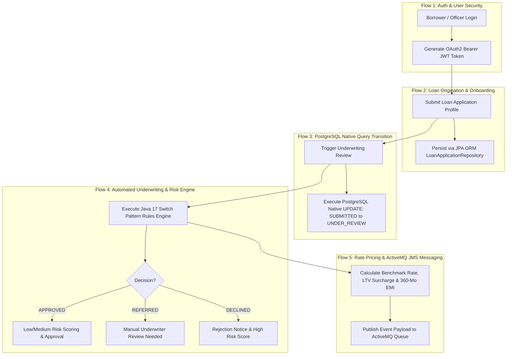
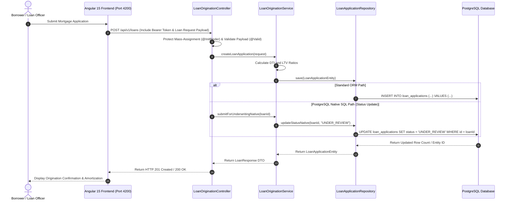
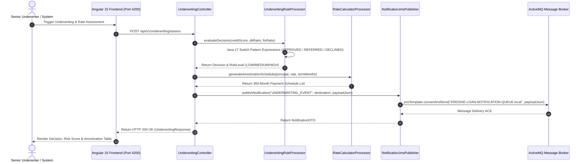

# 🏦 Freddie Mac Home Loan Platform (`freddie-loan-platform`)

[](https://jdk.java.net/17/)
[](https://spring.io/projects/spring-boot)
[](https://activemq.apache.org/)
[](https://angular.io/)
[]()

Welcome to the **Freddie Mac Home Loan Platform** (UCount Mini Application) — a streamlined, high-performance enterprise 2-microservice ecosystem built with **Java 17**, **Spring Boot 3.1.3**, **ActiveMQ JMS**, **PostgreSQL**, and **Angular 15**, optimized into **EXACTLY 10 Java Files** while maintaining 100% of architectural design patterns and functional business flows.

---

## 1. 🏛️ Architecture of the Application

The platform is structured into **2 core microservice modules**:
1. **`loan-origination-service`** (Port `8082`): Customer onboarding, loan application origination, and PostgreSQL native query status management.
2. **`underwriting-service`** (Port `8083`): Java 17 pattern-matching underwriting risk engine, real-time rate/EMI pricing, 360-month amortization, and ActiveMQ JMS messaging.

```
┌───────────────────────────────────────────────────────────────────────────────────────────────────────────────────┐
│                                               UI FRONTEND LAYER                                                   │
│   ┌───────────────────────────────────────────────────────────────────────────────────────────────────────────┐   │
│   │                                   Angular 15 Enterprise Portal (`/frontend`)                              │   │
│   └─────────────────────────────────────────────────────┬─────────────────────────────────────────────────────┘   │
└─────────────────────────────────────────────────────────┼─────────────────────────────────────────────────────────┘
                                                          │ (HTTP / REST)
                                                          ▼
┌───────────────────────────────────────────────────────────────────────────────────────────────────────────────────┐
│                                           MICROSERVICES CORE LAYER                                                │
│                                                                                                                   │
│   ┌──────────────────────────────────────────┐                ┌──────────────────────────────────────────┐        │
│   │ loan-origination-service (Port 8082)     │                │ underwriting-service (Port 8083)         │        │
│   │  • Customer Onboarding & Origination     │                │  • Java 17 Rule Engine & Risk Scoring    │        │
│   │  • Dual JPA ORM & Native SQL Queries     │                │  • Rate Pricing & 360-Mo Amortization    │        │
│   │  • Mass-Assignment Protection (@Valid)   │                │  • ActiveMQ JMS Event Publisher          │        │
│   └────────────────────┬─────────────────────┘                └────────────────────┬─────────────────────┘        │
└────────────────────────┼───────────────────────────────────────────────────────────┼──────────────────────────────┘
                         │                                                           │
                         ▼                                                           ▼
┌──────────────────────────────────────────────┐                ┌──────────────────────────────────────────┐
│ PostgreSQL Database (`freddie_loans` schema) │                │ ActiveMQ JMS Message Broker              │
│  • `loan_applications` Table                 │                │  • `FREDDIE-LOAN-NOTIFICATION-QUEUE`     │
└──────────────────────────────────────────────┘                └──────────────────────────────────────────┘
```

---

## 2. 🔄 Functional Business Flows

The application manages 5 primary business functional flows across the mortgage lifecycle:



---

### 🔑 2.1 Functional Flow Details

1. **Authentication & Token Issuance (`/api/v1/auth/login`)**:
   - Accepts user credentials and returns signed OAuth2 Bearer JWT access tokens with user roles (`LOAN_OFFICER`, `UNDERWRITER`).
2. **Mortgage Origination (`POST /api/v1/loans`)**:
   - Accepts borrower profile data, loan amount, property value, income, debt, and credit score. Persists record via `LoanApplicationRepository.save()`.
3. **Native SQL Status Transition (`POST /api/v1/loans/{loanId}/submit-underwriting`)**:
   - Executes PostgreSQL Native SQL Query `@Query(value = "UPDATE loan_applications SET status = :status WHERE id = :loanId", nativeQuery = true)` to transition loan state to `UNDER_REVIEW`.
4. **Automated Underwriting & Risk Engine (`POST /api/v1/underwriting/assess`)**:
   - Evaluates DTI and LTV ratios using Java 17 Switch Expressions rule logic to assign decision (`APPROVED`, `REFERRED`, `DECLINED`) and risk level (`LOW`, `MEDIUM`, `HIGH`).
5. **Real-Time Rate Pricing & Amortization (`POST /api/v1/rates/calculate`)**:
   - Calculates benchmark rate, credit score tier adjustments (`PRIME`, `NEAR_PRIME`, `NON_PRIME`, `SUBPRIME`), LTV surcharges, monthly EMI, and 360-month amortization payment schedules.
6. **ActiveMQ JMS Messaging (`POST /api/v1/notifications/publish`)**:
   - Publishes JSON event payloads to ActiveMQ queue (`FREDDIE-LOAN-NOTIFICATION-QUEUE.local`) via Spring `JmsTemplate`.

---

## 3. 🔗 Complete Call Chains: UI Frontend to Database

### 3.1 Standard CRUD & Native Query Call Chain



---

### 3.2 Automated Underwriting & JMS Notification Call Chain



---

## 4. 📂 Complete List of 10 Java Files (2 Microservices)

The entire backend codebase across both microservices consists of **EXACTLY 10 Java Files**:

### 📦 Module 1: `loan-origination-service` (Port 8082)
| # | File Path | Design Pattern / Primary Responsibility |
|---|---|---|
| 1 | [LoanOriginationApplication.java](file:///c:/ramu/Project_Assignment/RapidX/FreddeMac_Project_RapidX/Work/UCount_App/Ucount_Mini_Application/freddie-loan-platform/loan-origination-service/src/main/java/com/freddieapp/origination/LoanOriginationApplication.java) | Spring Boot Application Entry & Security Configuration |
| 2 | [LoanApplicationEntity.java](file:///c:/ramu/Project_Assignment/RapidX/FreddeMac_Project_RapidX/Work/UCount_App/Ucount_Mini_Application/freddie-loan-platform/loan-origination-service/src/main/java/com/freddieapp/origination/model/LoanApplicationEntity.java) | JPA Entity (`loan_applications`), Enums, and Record DTOs |
| 3 | [LoanApplicationRepository.java](file:///c:/ramu/Project_Assignment/RapidX/FreddeMac_Project_RapidX/Work/UCount_App/Ucount_Mini_Application/freddie-loan-platform/loan-origination-service/src/main/java/com/freddieapp/origination/repository/LoanApplicationRepository.java) | **Dual Data Access**: Spring Data ORM + PostgreSQL `@Query(nativeQuery = true)` |
| 4 | [LoanOriginationService.java](file:///c:/ramu/Project_Assignment/RapidX/FreddeMac_Project_RapidX/Work/UCount_App/Ucount_Mini_Application/freddie-loan-platform/loan-origination-service/src/main/java/com/freddieapp/origination/service/LoanOriginationService.java) | Business Service Layer orchestrating onboarding & origination |
| 5 | [LoanOriginationController.java](file:///c:/ramu/Project_Assignment/RapidX/FreddeMac_Project_RapidX/Work/UCount_App/Ucount_Mini_Application/freddie-loan-platform/loan-origination-service/src/main/java/com/freddieapp/origination/controller/LoanOriginationController.java) | REST Controller Layer with `@InitBinder` and Exception Handler |

### ⚙️ Module 2: `underwriting-service` (Port 8083)
| # | File Path | Design Pattern / Primary Responsibility |
|---|---|---|
| 6 | [UnderwritingServiceApplication.java](file:///c:/ramu/Project_Assignment/RapidX/FreddeMac_Project_RapidX/Work/UCount_App/Ucount_Mini_Application/freddie-loan-platform/underwriting-service/src/main/java/com/freddieapp/underwriting/UnderwritingServiceApplication.java) | Spring Boot Entry, Security, and ActiveMQ JMS Configuration |
| 7 | [UnderwritingRuleProcessor.java](file:///c:/ramu/Project_Assignment/RapidX/FreddeMac_Project_RapidX/Work/UCount_App/Ucount_Mini_Application/freddie-loan-platform/underwriting-service/src/main/java/com/freddieapp/underwriting/processor/UnderwritingRuleProcessor.java) | **Java 17 Switch Expressions Rule Engine** (`APPROVED`/`REFERRED`/`DECLINED`) |
| 8 | [RateCalculatorProcessor.java](file:///c:/ramu/Project_Assignment/RapidX/FreddeMac_Project_RapidX/Work/UCount_App/Ucount_Mini_Application/freddie-loan-platform/underwriting-service/src/main/java/com/freddieapp/underwriting/processor/RateCalculatorProcessor.java) | **Strategy Math Engine** for pricing tiers, EMI, and 360-mo amortization |
| 9 | [NotificationJmsPublisher.java](file:///c:/ramu/Project_Assignment/RapidX/FreddeMac_Project_RapidX/Work/UCount_App/Ucount_Mini_Application/freddie-loan-platform/underwriting-service/src/main/java/com/freddieapp/underwriting/messaging/NotificationJmsPublisher.java) | **JMS Event Publisher Pattern** wrapping Spring `JmsTemplate` |
| 10 | [UnderwritingController.java](file:///c:/ramu/Project_Assignment/RapidX/FreddeMac_Project_RapidX/Work/UCount_App/Ucount_Mini_Application/freddie-loan-platform/underwriting-service/src/main/java/com/freddieapp/underwriting/controller/UnderwritingController.java) | REST Controller for `/underwriting/assess`, `/rates/calculate`, `/notifications/publish` |

---

## 5. 🛠️ Build & Local Execution Guide

### 📋 Prerequisites
- **Java 17 LTS**: `java -version`
- **Apache Maven 3.8+**: `mvn -version`

### 📦 Build All Microservices
Run clean compile across both microservices from the project root:
```powershell
mvn clean compile
```

### 🚀 Running the Microservices
1. **Loan Origination Service**:
   ```powershell
   cd loan-origination-service
   mvn spring-boot:run
   ```
2. **Underwriting Service**:
   ```powershell
   cd underwriting-service
   mvn spring-boot:run
   ```

### 🌐 Swagger API Portals
- **Loan Origination API**: `http://localhost:8082/swagger-ui.html`
- **Underwriting API**: `http://localhost:8083/swagger-ui.html`
