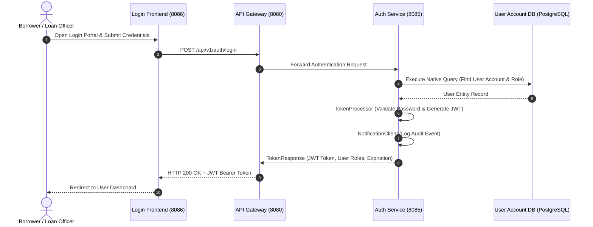
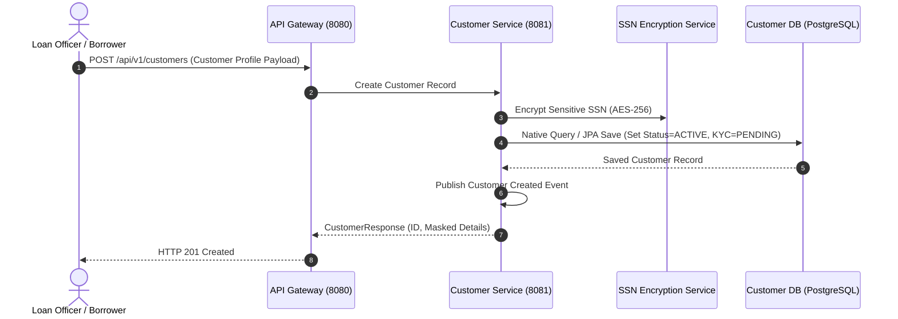
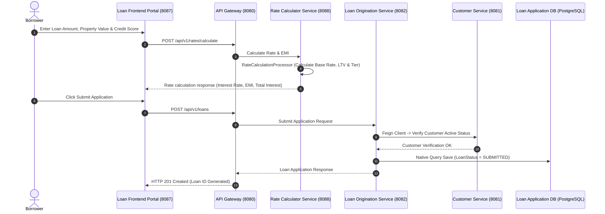
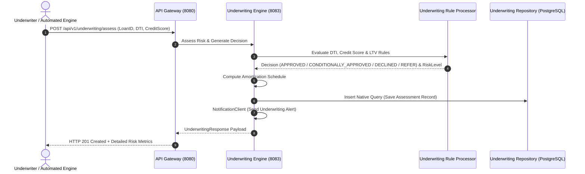
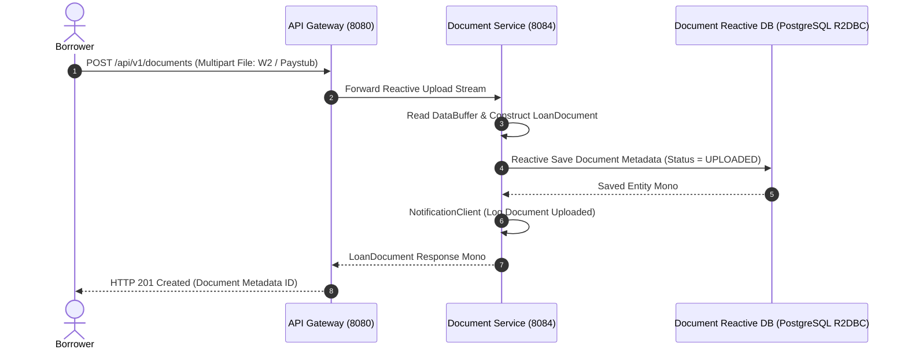

# Freddie Mac-Style Home Loan & Customer Management Platform

This repository contains a streamlined, production-grade, distributed Home Loan Application and Customer Management system designed around Freddie Mac system specifications. It employs a domain-driven microservices architecture supporting core mortgage lifecycle phases: borrower intake, user authentication, loan origination, document management, rate calculation, and automated underwriting risk assessment.

---

## 🎯 Architecture Blueprint

The platform uses a lean, high-performance microservices architecture comprising **10 microservices** (plus root aggregator) communicating via synchronous REST endpoints, Spring Cloud Gateway, Netflix Eureka service discovery, and dedicated PostgreSQL databases.

```
                                 ┌───────────────────────────────────────┐
                                 │   Portal Clients / User Interfaces    │
                                 │ ┌──────────────────┐ ┌──────────────┐ │
                                 │ │ Login Portal (8086)│ │ Loan Portal  │ │
                                 │ └────────┬─────────┘ └──────┬───────┘ │
                                 └──────────┼──────────────────┼─────────┘
                                            │ (HTTPS / REST)   │
                                            ▼                  ▼
                                ┌─────────────────────────────────────────┐
                                │          API Gateway (Port 8080)        │
                                └────────────────────┬────────────────────┘
                                                     │
         ┌───────────────────┬───────────────────────┼───────────────────────┬───────────────────┐
         ▼                   ▼                       ▼                       ▼                   ▼
┌─────────────────┐ ┌──────────────────┐  ┌────────────────────┐ ┌───────────────────┐ ┌───────────────────┐
│  Auth Service   │ │ Customer Service │  │  Loan Origination  │ │Underwriting Engine│ │ Document Service  │
│   (Port 8085)   │ │   (Port 8081)    │  │    (Port 8082)     │ │    (Port 8083)    │ │    (Port 8084)    │
└────────┬────────┘ └────────┬─────────┘  └─────────┬──────────┘ └─────────┬─────────┘ └─────────┬─────────┘
         │                   │                      │                      │                     │
         ▼                   ▼                      ▼                      ▼                     ▼
┌─────────────────┐ ┌──────────────────┐  ┌────────────────────────────────────────┐ ┌───────────────────┐
│ Account Details │ │ Customer Details │  │     Loan Application PostgreSQL DB     │ │ Customer Details  │
│  PostgreSQL DB  │ │  PostgreSQL DB   │  │             (freddie_loans)            │ │   PostgreSQL DB   │
│ (user_accounts) │ │ (freddie_customer│  └────────────────────────────────────────┘ │ (freddie_customer)│
└─────────────────┘ └──────────────────┘                                           └───────────────────┘
```

---

## 🏛️ Standardized Directory & Package Structure

All backend services adhere strictly to the following uniform package layout pattern:

```text
com.freddieapp.<service>/
├── client/notification/  # Inter-service Feign/WebClient & Notification clients
├── config/               # Spring & Swagger/OpenAPI configurations (Swagger2Config.java)
├── controller/           # REST Controllers (@RestController)
├── dto/                  # Data Transfer Objects & Request/Response payloads
├── enums/                # Standalone Enum classes (e.g. LoanStatus, UserRole, Decision)
├── exception/            # Custom domain exceptions & GlobalExceptionHandler (@RestControllerAdvice)
├── processor/            # Business logic rules & data processing engines
├── repository/           # Repositories (Spring Data ORM + Native SQL @Query methods)
├── service/              # Service interface contracts & implementations (@Service)
├── specification/        # Search & JPA Specifications
└── <ServiceName>Application.java
```

---

## ⚡ Backend Architecture Pattern

Each service enforces a clean **Controller → Service → Repository** separation of concerns:

```
                  HTTP REST Request
                         │
                         ▼
             ┌──────────────────────┐
             │     Controller       │  (@RestController, /api/v1/...)
             └───────────┬──────────┘
                         │
                         ▼
             ┌──────────────────────┐
             │      Service         │  (@Service, @Transactional)
             └──────┬────────┬──────┘
                    │        │
          ┌─────────┘        └─────────┐
          ▼                            ▼
┌───────────────────┐        ┌───────────────────┐
│     Processor     │        │    Repository     │  (Spring Data ORM +
│ (Business Rules)  │        │   (Native Query)  │   Native SQL Queries)
└───────────────────┘        └───────────────────┘
```

* **Controller Layer**: Handles REST requests, validates payload parameters, and returns standardized HTTP responses.
* **Service Layer**: Manages core business transactions, orchestrates processors, invokes inter-service Feign/WebClient calls, and coordinates notification clients.
* **Processor Layer**: Houses isolated domain rules (e.g., rate scoring, risk scoring, token hashing, input sanitization).
* **Repository Layer**: Combines standard Spring Data ORM capabilities with explicit native SQL queries (`@Query(..., nativeQuery = true)`) for maximum performance and flexible querying.
* **Exception Layer**: Provides centralized error translation via `@RestControllerAdvice` (`GlobalExceptionHandler`).

---

## 🧱 Microservices Portfolio

The multi-module project aggregates 10 active microservices:

| # | Microservice Module | Port | Architecture & Technology | Database / Persistence | Functional Scope |
|---|---|---|---|---|---|
| 1 | `eureka-server` | 8761 | Spring Cloud Netflix Eureka | Memory | Service Registry & Discovery Server |
| 2 | `api-gateway` | 8080 | Spring Cloud Gateway (Reactive) | - | Edge API Gateway & Dynamic Route Dispatcher |
| 3 | `auth-service` | 8085 | Pure Spring Microservice | PostgreSQL (`user_accounts`) | Authentication, User Account Details & JWT Token Generation |
| 4 | `customer-service` | 8081 | Pure Spring Microservice | PostgreSQL (`freddie_customer`) | Borrower Profile, KYC & SSN Encryption |
| 5 | `loan-origination-service` | 8082 | Pure Spring Microservice | PostgreSQL (`freddie_loans`) | Mortgage Application Intake, Tracking & Status Workflow |
| 6 | `underwriting-service` | 8083 | Pure Spring Microservice | PostgreSQL (`freddie_loans`) | Automated Risk Assessment, Amortization & Manual Override |
| 7 | `document-service` | 8084 | Spring WebFlux (Reactive R2DBC) | PostgreSQL (`freddie_customer`) | Document Storage Metadata & Verification |
| 8 | `login-frontend-service` | 8086 | Pure Spring MVC | PostgreSQL (`user_accounts`) | Dedicated Login UI Frontend & Portal Audit Service |
| 9 | `loan-frontend-service` | 8087 | Pure Spring MVC | PostgreSQL (`freddie_loans`) | Dedicated Loan Application & Tracking UI Portal |
| 10 | `rate-calculator-service` | 8088 | Pure Spring Microservice | InMemory Benchmark Tables | Mortgage Interest Rate, LTV/Credit Adjustment & EMI Calculator |

---

## 🔗 Call Chains from UI to DB

Below are the detailed execution call chains mapping every class, method, processor, query, and database table in the flow from UI to Database across the primary user operations:

### 1. 🔑 User Login & Authentication Call Chain (UI → DB)

```text
[ Browser / Login UI (Port 8086) ]
           │
           │  HTTP POST /api/v1/auth/login
           ▼
[ API Gateway (Port 8080) ]
           │  (Dispatches route to AUTH-SERVICE)
           ▼
[ AuthController.java ]  (com.freddieapp.auth.controller)
   └── method: login(@Valid @RequestBody LoginRequest request)
           │
           ▼
[ AuthService.java ]  (com.freddieapp.auth.service)
   └── method: login(LoginRequest request)
           │
           ├──► [ TokenProcessor.java ]  (com.freddieapp.auth.processor)
           │       └── method: sanitizeUsername(username)
           │
           ├──► [ UserRepository.java ]  (com.freddieapp.auth.repository)
           │       └── method: findUserAccountNative(String username)
           │               │
           │               ▼  (Native SQL Execution)
           │       SELECT * FROM user_accounts WHERE username = :username AND status = 'ACTIVE'
           │               │
           │               ▼  (Database Table Target)
           │       PostgreSQL Database (`user_accounts` DB) -> Table: `user_accounts`
           │
           ├──► [ TokenProcessor.java ]  (com.freddieapp.auth.processor)
           │       └── method: validateCredentials(inputPassword, storedPassword)
           │
           ├──► [ JwtTokenProvider.java ]  (com.freddieapp.auth.config)
           │       └── method: generateToken(username, roles) -> Produces JWT Bearer Token
           │
           └──► [ NotificationClient.java ]  (com.freddieapp.auth.client.notification)
                   └── method: notifyAuthSuccess(username)
```

---

### 2. 📝 Loan Application Submission Call Chain (UI → DB)

```text
[ Browser / Loan Portal UI (Port 8087) ]
           │
           │  HTTP POST /api/v1/loans
           ▼
[ API Gateway (Port 8080) ]
           │  (Dispatches route to LOAN-ORIGINATION-SERVICE)
           ▼
[ LoanController.java ]  (com.freddieapp.loanorigination.controller)
   └── method: submitLoanApplication(@Valid @RequestBody LoanApplicationRequest request)
           │
           ▼
[ LoanOriginationService.java ]  (com.freddieapp.loanorigination.service)
   └── method: submitLoanApplication(LoanApplicationRequest request)
           │
           ├──► [ CustomerClient.java (Feign) ]  (com.freddieapp.loanorigination.client)
           │       └── HTTP GET /api/v1/customers/{customerId}
           │               ▼
           │       [ CustomerService.java ] in customer-service
           │               ▼
           │       SELECT * FROM customers WHERE customer_id = :id  (PostgreSQL: `freddie_customer` DB)
           │
           ├──► [ LoanRuleProcessor.java ]  (com.freddieapp.loanorigination.processor)
           │       └── method: evaluateEligibility(loanAmount, dtiRatio) -> Asserts Minimum Criteria
           │
           ├──► [ LoanSpecification.java ]  (com.freddieapp.loanorigination.specification)
           │       └── method: isEligibleForOrigination(LoanStatus.SUBMITTED)
           │
           ├──► [ LoanApplicationRepository.java ]  (com.freddieapp.loanorigination.repository)
           │       └── method: saveNativeLoanApplication(...)  or  save(LoanApplication)
           │               │
           │               ▼  (Native SQL / ORM Execution)
           │       INSERT INTO loan_applications (loan_id, customer_id, loan_amount, status, created_at)
           │       VALUES (:loanId, :customerId, :loanAmount, 'SUBMITTED', CURRENT_TIMESTAMP)
           │               │
           │               ▼  (Database Table Target)
           │       PostgreSQL Database (`freddie_loans` DB) -> Table: `loan_applications`
           │
           └──► [ NotificationClient.java ]  (com.freddieapp.loanorigination.client.notification)
                   └── method: sendLoanSubmissionNotification(loanId, customerId)
```

---

### 3. ⚖️ Automated Underwriting & Risk Assessment Call Chain (UI/API → DB)

```text
[ Underwriter Portal / Rest Client ]
           │
           │  HTTP POST /api/v1/underwriting/assess
           ▼
[ API Gateway (Port 8080) ]
           │  (Dispatches route to UNDERWRITING-SERVICE)
           ▼
[ UnderwritingController.java ]  (com.freddieapp.underwriting.controller)
   └── method: assessLoan(@Valid @RequestBody UnderwritingRequest request)
           │
           ▼
[ UnderwritingEngine.java ]  (com.freddieapp.underwriting.service)
   └── method: assessLoan(UnderwritingRequest request)
           │
           ├──► [ UnderwritingRuleProcessor.java ]  (com.freddieapp.underwriting.processor)
           │       ├── method: calculateDti(monthlyIncome, monthlyDebt)
           │       ├── method: calculateLtv(loanAmount, propertyValue)
           │       └── method: evaluateRiskTier(creditScore, dti, ltv) 
           │               └── Returns: Decision (APPROVED/DECLINED/REFER), RiskLevel (LOW/HIGH)
           │
           ├──► [ UnderwritingSpecification.java ]  (com.freddieapp.underwriting.specification)
           │       └── method: isAutoApproveEligible(RiskLevel.LOW)
           │
           ├──► [ UnderwritingAssessmentRepository.java ]  (com.freddieapp.underwriting.repository)
           │       └── method: saveNativeAssessment(...)  or  save(UnderwritingAssessment)
           │               │
           │               ▼  (Native SQL Execution)
           │       INSERT INTO underwriting_assessments 
           │       (assessment_id, loan_id, customer_id, credit_score, dti_ratio, ltv_ratio, decision, risk_level)
           │       VALUES (:assessmentId, :loanId, :customerId, :creditScore, :dti, :ltv, :decision, :riskLevel)
           │               │
           │               ▼  (Database Table Target)
           │       PostgreSQL Database (`freddie_loans` DB) -> Table: `underwriting_assessments`
           │
           └──► [ NotificationClient.java ]  (com.freddieapp.underwriting.client.notification)
                   └── method: notifyUnderwritingDecision(loanId, decision.name())
```

---

### 4. 📄 Document Storage & Management Call Chain (UI → DB)

```text
[ Browser / Document Upload Form ]
           │
           │  HTTP POST /api/v1/documents (Multipart File Stream)
           ▼
[ API Gateway (Port 8080) ]
           │  (Dispatches route to DOCUMENT-SERVICE)
           ▼
[ DocumentController.java ]  (com.freddieapp.documentservice.controller)
   └── method: uploadDocument(loanId, customerId, documentType, filePartMono)
           │
           ▼
[ DocumentService.java ]  (com.freddieapp.documentservice.service)
   └── method: uploadDocument(loanId, customerId, documentType, filePartMono)
           │
           ├──► [ DocumentProcessor.java ]  (com.freddieapp.documentservice.processor)
           │       └── method: validateMimeType(contentType) & sanitizeFileName(filename)
           │
           ├──► [ LoanDocumentRepository.java (R2DBC) ]  (com.freddieapp.documentservice.repository)
           │       └── method: save(LoanDocument)
           │               │
           │               ▼  (Reactive R2DBC SQL Execution)
           │       INSERT INTO loan_documents (document_id, loan_id, customer_id, document_type, status)
           │       VALUES ($1, $2, $3, $4, 'UPLOADED')
           │               │
           │               ▼  (Database Table Target)
           │       PostgreSQL Database (`freddie_customer` DB) -> Table: `loan_documents`
           │
           └──► [ NotificationClient.java ]  (com.freddieapp.documentservice.client.notification)
                   └── method: notifyDocumentUploaded(documentId, loanId)
```

---

## 🔄 End-to-End Functional Flows

### Flow 1: User Authentication & Login Portal Flow


---

### Flow 2: Customer Intake & KYC Verification Flow


---

### Flow 3: Mortgage Rate Calculation & Application Submission Flow


---

### Flow 4: Automated Underwriting & Risk Assessment Flow


---

### Flow 5: Document Upload & Storage Verification Flow


---

## 🛠️ Build & Verification

### Build Entire Platform Multi-Module Reactor
```bash
mvn clean package -DskipTests
```

### Run Full Test Suite Across All Modules
```bash
mvn clean test
```

### Running Locally with Spring Boot
Start the key infrastructure and database services, then launch individual microservices:
```bash
# 1. Start Service Registry
cd eureka-server && mvn spring-boot:run

# 2. Start API Gateway
cd api-gateway && mvn spring-boot:run

# 3. Start Core Domain Services
cd auth-service && mvn spring-boot:run
cd customer-service && mvn spring-boot:run
cd loan-origination-service && mvn spring-boot:run
cd underwriting-service && mvn spring-boot:run
cd document-service && mvn spring-boot:run
cd rate-calculator-service && mvn spring-boot:run
cd login-frontend-service && mvn spring-boot:run
cd loan-frontend-service && mvn spring-boot:run
```
