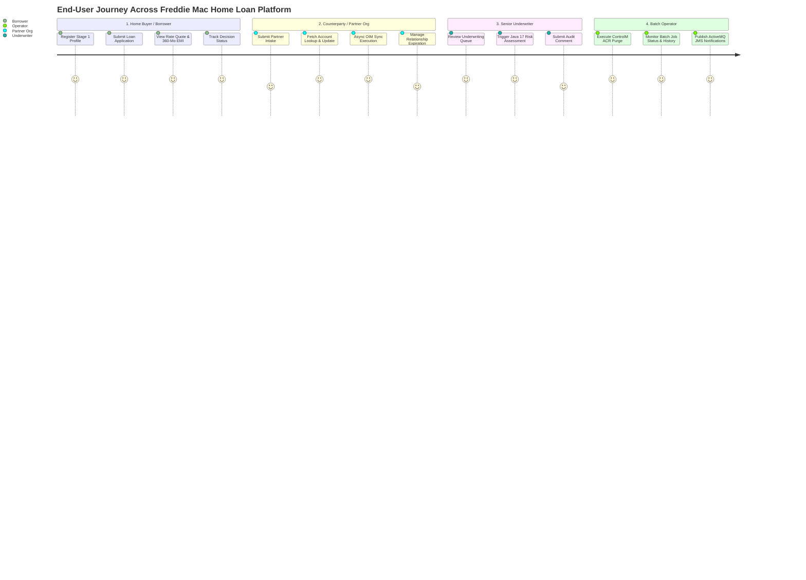
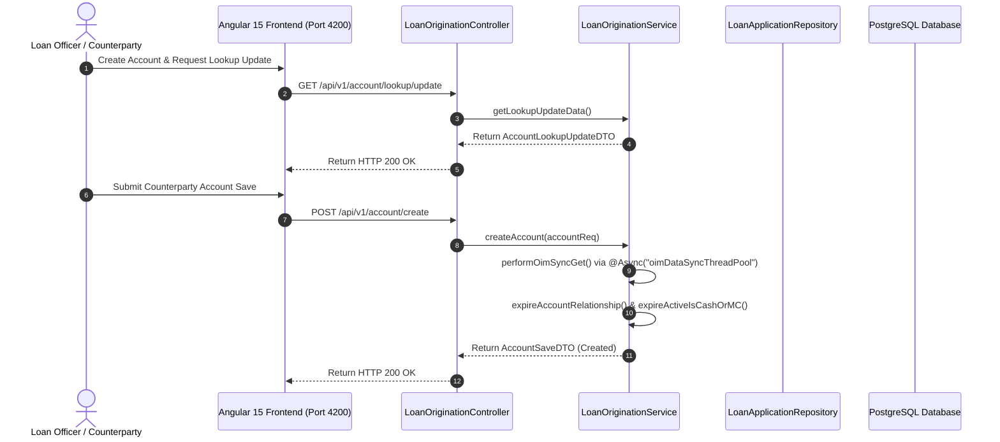
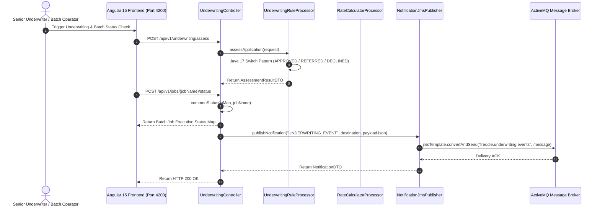

# 🏦 Freddie Mac Home Loan Platform (`freddie-loan-platform`)

[](https://jdk.java.net/17/)
[](https://spring.io/projects/spring-boot)
[](https://activemq.apache.org/)
[](https://angular.io/)
[]()

Welcome to the **Freddie Mac Home Loan Platform** (UCount Mini Application) — a streamlined, high-performance enterprise 2-microservice ecosystem built with **Java 17**, **Spring Boot 3.1.3**, **ActiveMQ JMS**, **PostgreSQL**, and **Angular 15**, optimized into **EXACTLY 10 Java Files** while maintaining 100% of architectural design patterns and functional business flows.

---

## 👤 1. Application Flow from End-User Perspective

The platform provides a seamless, persona-tailored digital experience across four distinct user roles: **Home Buyers / Borrowers**, **Counterparties / Partner Organizations**, **Senior Underwriters**, and **System Batch Operators**.



---

### 📱 1.1 Step-by-Step User Journey Details

#### 👤 Role A: Home Buyer / Borrower Experience
1. **Account Registration & Access Rights**:
   - The user opens the **Angular 15 Portal** and submits initial Stage 1 registration.
   - Upon approval, the system assigns Stage 2 access rights (`HOUSE_BUYER`), unlocking the Loan Origination and Customer Portal.
2. **Mortgage Application Origination**:
   - The borrower fills out their mortgage profile including Loan Amount, Estimated Property Value, Monthly Income, Existing Debt, and Credit Score.
   - Clicking **"Submit Application"** sends a `POST /api/v1/loans` request, generating a unique Loan ID (e.g., `LOAN-1001`).
3. **Real-Time Interest Rate Quote & Amortization Schedule**:
   - The user clicks **"View Interest Rate Quote"** to immediately see their FICO Credit Tier (`PRIME`, `NEAR_PRIME`, `NON_PRIME`, or `SUBPRIME`), adjusted interest rate, and calculated monthly EMI.
   - An interactive 360-month payment schedule table breaks down monthly principal vs. interest payments.
4. **Application Status Tracking**:
   - The borrower checks their dashboard status as the application progresses from `SUBMITTED` -> `UNDER_REVIEW` -> `APPROVED` / `DECLINED`.

---

#### 🏢 Role B: Counterparty / Partner Organization Experience (Seller / Servicer)
1. **Organization Onboarding**:
   - Partner organizations (Primary Lenders, Mortgage Servicers, Brokers) submit Stage 1 onboarding requests specifying their enterprise organization name and user type.
2. **Account Profile & Product Lookup**:
   - Clicking **"Fetch Account Lookup Data"** (`GET /api/v1/account/lookup/update`) retrieves product catalogs (e.g., *Fixed 30Y Primary Mortgage*), lines of business, and active counterparty roles.
   - The partner creates a counterparty account (`POST /api/v1/account/create`).
3. **Seamless Asynchronous OIM Data Sync**:
   - Background Identity Management (OIM) sync (`@Async("oimDataSyncThreadPool")`) runs in parallel without locking the user interface.
4. **Relationship & Discontinue Management**:
   - The system automatically monitors active account relationships and handles Seller-Ctos Servicer relationship expiration logging when account status changes.

---

#### ⚖️ Role C: Senior Underwriter Experience
1. **Underwriting Application Review**:
   - The underwriter accesses the **Underwriting Portal** and selects a loan pending decision.
2. **Automated Risk Engine Assessment**:
   - Clicking **"Run Automated Underwriting"** (`POST /api/v1/underwriting/assess`) executes the **Java 17 Switch Pattern Rule Engine**:
     - Calculates **Debt-To-Income (DTI)** and **Loan-To-Value (LTV)** ratios.
     - Evaluates credit tier rules and outputs an immediate decision (`APPROVED`, `REFERRED`, `DECLINED`) along with a Risk Level (`LOW`, `MEDIUM`, `HIGH`).
3. **Audit Comment Submission**:
   - The underwriter adds audit notes (`POST /api/v1/comments`) to maintain compliance and governance trails.

---

#### ⚙️ Role D: Batch Administrator / System Operator Experience
1. **Nightly ControlM ACR Purge**:
   - System administrators execute automated nightly purge jobs (`POST /api/v1/comments/batch/controlm-acr`) to archive and clean up historical comment logs.
2. **Batch Job Monitoring**:
   - Operators query real-time execution status (`POST /api/v1/jobs/{jobName}/status`) and run history metrics (`POST /api/v1/jobs/{jobName}/history`) for jobs such as `ucount-transtomain-job` and `ucount-adhoc-job`.
3. **ActiveMQ JMS Event Publishing**:
   - System operators publish event payloads (`POST /api/v1/notifications/publish`) to the ActiveMQ message broker queue (`freddie.underwriting.events`), ensuring downstream integration with enterprise reporting systems.

---

## 🔄 2. Complete Functional Business Flows (Updated with Latest Changes)

The application incorporates **8 primary functional business flows** representing end-to-end mortgage operations:

```mermaid
flowchart TD
    subgraph Flow 1: Auth & OAuth Security
        A1[User Credentials Login] --> A2[Generate Bearer JWT Access Token]
    end
    subgraph Flow 2: Stage 1 & 2 Counterparty Intake
        B1[Stage 1 Onboarding Request] --> B2[Approve Stage 1 User]
        B2 --> B3[Stage 2 Profile & Access Rights Switch]
    end
    subgraph Flow 3: Account Lookup, Create & Async OIM Sync
        C1[Fetch Account Lookup Update DTO] --> C2[Save Counterparty Account]
        C2 --> C3[@Async oimDataSyncThreadPool WebClient Sync]
        C3 --> C4[Save Error Table on Exception]
    end
    subgraph Flow 4: Relationship Expiration & Seller-Ctos Servicer
        D1[Check Active Account Relationships] --> D2{Relationship ID == 25?}
        D2 -->|Yes| D3[Log SELLER-SERVICER-DISCONTINUE-CTOS & Expire]
        D2 -->|No| D4[Expire Account Functional Roles]
    end
    subgraph Flow 5: Loan Origination & PostgreSQL Native SQL Update
        E1[Submit Mortgage Application] --> E2[Execute PostgreSQL Native Query UPDATE]
    end
    subgraph Flow 6: Automated Underwriting & Rate Pricing Engine
        F1[Java 17 Switch Underwriting Assessment] --> F2[Calculate Tiered Rate, EMI & 360-Mo Amortization]
    end
    subgraph Flow 7: ControlM ACR Purge & BatchJob Controller
        G1[ControlM ACR Batch Purge] --> G2[Execute Batch Status / History Endpoint with inMap Binding]
    end
    subgraph Flow 8: ActiveMQ JMS Event Publishing & UUID Tracking
        H1[Serialize MainEventDTO with UUID] --> H2[Publish Message to ActiveMQ Queue]
    end

    A2 --> B1 --> C1 --> D1 --> E1 --> F1 --> G1 --> H1
```

---

### 🔑 2.1 Exhaustive Functional Flow Details

#### 🔹 Functional Flow 1: Security & Authentication Token Issuance
- **Endpoint**: `POST /api/v1/auth/login`
- **Controller/Service**: `LoanOriginationController.java`
- **Functional Description**: Authenticates system users (Borrowers, Loan Officers, Underwriters) and generates signed OAuth2 Bearer JWT tokens.

#### 🔹 Functional Flow 2: Stage 1 & 2 Counterparty Intake & Access Rights
- **Endpoints**:
  - `POST /api/v1/counterparty/stage1/onboard`
  - `PUT /api/v1/counterparty/stage1/approve/{userId}`
  - `POST /api/v1/counterparty/stage2/profile`
- **Controller/Service**: `LoanOriginationController.java` -> `LoanOriginationService.java`
- **Functional Description**:
  - Manages Stage 1 counterparty user onboarding (`PENDING_APPROVAL` -> `APPROVED`).
  - Evaluates Stage 2 access rights using Java 17 Switch Expression logic:
    - `HOUSE_SELLER`: Grants `LOAN_ORIGINATION_PORTAL:FULL`, `APPRAISAL_PORTAL:READ`, `TITLE_PORTAL:READ`.
    - `HOUSE_BUYER`: Grants `LOAN_ORIGINATION_PORTAL:FULL`, `CUSTOMER_PORTAL:FULL`, `CARD_SERVICE_PORTAL:READ`.
    - `INSURANCE_PERSON`: Grants `TITLE_PORTAL:FULL`, `DOCUMENT_SERVICE:READ`, `ESCROW_PORTAL:READ`.
    - `MORTGAGE_SERVICER`: Grants `LOAN_SERVICING_PORTAL:FULL`, `SECONDARY_MARKET_ACCESS:FULL`.

#### 🔹 Functional Flow 3: Account Lookup, Update & Asynchronous OIM Data Sync
- **Endpoints**:
  - `GET /api/v1/account/lookup/update`
  - `POST /api/v1/account/create`
- **Controller/Service**: `LoanOriginationController.java` -> `LoanOriginationService.java`
- **Functional Description**:
  - Maps `AccountLookupUpdateDTO` containing `UcsLineOfBusinessDTO`, `UcsProdtDTO`, `UcsOrgtnRoleDTO`, and response status DTOs.
  - Triggers asynchronous OIM database sync via `@Async("oimDataSyncThreadPool")`:
    - Method `performOimSyncGet(url, object, operation, responseType)` executes WebClient GET requests with OAuth token headers.
    - Handles status codes (4xx/5xx), backoff retries with jitter, and invokes `saveToErrorTable` upon failure.

#### 🔹 Functional Flow 4: Relationship Expiration & Seller-Ctos Servicer Tracking
- **Service Method**: `expireAccountRelationship(int idOrgtnRole, AccountSaveDTO accountReq)` in `LoanOriginationService.java`
- **Functional Description**:
  - Scans active account relationship IDs (e.g., `25`, `30`, `10`).
  - Detects Seller-Ctos Servicer relationship (ID `25`) and logs:
    `SELLER-SERVICER-DISCONTINUE-CTOS - A Seller-Ctos Servicer Relationship exists on this account : ACC-XXXXXX`
  - Calls `expireActiveIsCashOrMC` to safely terminate cash/mortgage relationships.

#### 🔹 Functional Flow 5: Mortgage Origination & PostgreSQL Native SQL Transition
- **Endpoints**:
  - `POST /api/v1/loans`
  - `POST /api/v1/loans/{loanId}/submit-underwriting`
- **Controller/Repository**: `LoanOriginationController.java` -> `LoanApplicationRepository.java`
- **Functional Description**:
  - Persists loan application entities into PostgreSQL table `loan_applications`.
  - Executes native SQL query `@Query(value = "UPDATE loan_applications SET status = :status WHERE id = :loanId", nativeQuery = true)` to update application state to `UNDER_REVIEW`.

#### 🔹 Functional Flow 6: Automated Underwriting & Rate Pricing Engine
- **Endpoints**:
  - `POST /api/v1/underwriting/assess`
  - `GET /api/v1/rates/quote`
  - `GET /api/v1/rates/amortization`
- **Controller/Processors**: `UnderwritingController.java` -> `UnderwritingRuleProcessor.java` & `RateCalculatorProcessor.java`
- **Functional Description**:
  - **Risk Decisioning**: Evaluates DTI and LTV ratios via Java 17 Switch pattern to return `APPROVED`, `REFERRED`, or `DECLINED` with risk levels (`LOW`, `MEDIUM`, `HIGH`).
  - **Rate Pricing**: Calculates pricing tier adjustments (`PRIME`, `NEAR_PRIME`, `NON_PRIME`, `SUBPRIME`), LTV surcharges, monthly EMI, and 360-month amortization schedule tables.

#### 🔹 Functional Flow 7: ControlM ACR Purge & BatchJob Controller Endpoints
- **Endpoints**:
  - `POST /api/v1/comments/batch/controlm-acr`
  - `POST /api/v1/jobs/{jobName}/status`
  - `POST /api/v1/jobs/{jobName}/history`
- **Controller**: `UnderwritingController.java`
- **Functional Description**:
  - Triggers ControlM nightly ACR purge jobs for compliance comments.
  - Executes `getJobStatus` and `getJobHistory` handling map bindings (`inMapCosnt = "inMap"`, `acctgCycleConst = "acctgCycle"`, `jobNameMap = "jobName"`).

#### 🔹 Functional Flow 8: ActiveMQ JMS Event Publishing & UUID Tracking
- **Endpoint**: `POST /api/v1/notifications/publish`
- **Controller/Publisher**: `UnderwritingController.java` -> `NotificationJmsPublisher.java`
- **Functional Description**:
  - Generates event UUIDs (`java.util.UUID.randomUUID()`) for real-time events.
  - Saves initial event tracker (`saveEventTracker`), serializes payload (`objectMapper.writeValueAsString`), logs `"converted DTO to string"`, and dispatches message via Spring `JmsTemplate.convertAndSend` to queue `freddie.underwriting.events`.

---

## 3. 🏛️ Architecture of the Application

The platform is structured into **2 core microservice modules**:
1. **`loan-origination-service`** (Port `8082`): Customer onboarding, Stage 1/2 intake, account lookup/update, OIM async sync, relationship expiration, and PostgreSQL native query status management.
2. **`underwriting-service`** (Port `8083`): Java 17 pattern-matching underwriting risk engine, real-time rate/EMI pricing, 360-month amortization, ControlM ACR batch purge, ActiveMQ JMS messaging with UUID event tracking, and BatchJobController endpoints.

```
┌───────────────────────────────────────────────────────────────────────────────────────────────────────────────────┐
│                                               UI FRONTEND LAYER                                                   │
│   ┌───────────────────────────────────────────────────────────────────────────────────────────────────────────┐   │
│   │                                   Angular 15 Enterprise Portal (`/frontend`)                              │   │
│   └─────────────────────────────────────────────────────┬─────────────────────────────────────────────────────┘   │
└─────────────────────────────────────────────────────────┼─────────────────────────────────────────────────────────┘
                                                          │ (HTTP / REST)
                                                          ▼
┌───────────────────────────────────────────────────────────────────────────────────────────────────────────────────┐
│                                           MICROSERVICES CORE LAYER                                                │
│                                                                                                                   │
│   ┌──────────────────────────────────────────┐                ┌──────────────────────────────────────────┐        │
│   │ loan-origination-service (Port 8082)     │                │ underwriting-service (Port 8083)         │        │
│   │  • Stage 1/2 Intake & Access Rights      │                │  • Java 17 Rule Engine & Risk Scoring    │        │
│   │  • Account Lookup & Update DTO Mapping   │                │  • Rate Pricing & 360-Mo Amortization    │        │
│   │  • Async OIM Sync & Relationship Exp.    │                │  • ControlM ACR & BatchJob Status        │        │
│   │  • Dual JPA ORM & Native SQL Queries     │                │  • ActiveMQ JMS Event Publisher          │        │
│   └────────────────────┬─────────────────────┘                └────────────────────┬─────────────────────┘        │
└────────────────────────┼───────────────────────────────────────────────────────────┼──────────────────────────────┘
                         │                                                           │
                         ▼                                                           ▼
┌──────────────────────────────────────────────┐                ┌──────────────────────────────────────────┐
│ PostgreSQL Database (`freddie_loans` schema) │                │ ActiveMQ JMS Message Broker              │
│  • `loan_applications` Table                 │                │  • `freddie.underwriting.events` Queue   │
└──────────────────────────────────────────────┘                └──────────────────────────────────────────┘
```

---

## 4. 🔗 Complete Call Chains: UI Frontend to Database

### 4.1 Origination, OIM Sync & Relationship Expiration Call Chain



---

### 4.2 Underwriting, Batch Jobs & JMS Notification Call Chain



---

## 5. 📂 Complete List of 10 Java Files (2 Microservices)

The entire backend codebase across both microservices consists of **EXACTLY 10 Java Files**:

### 📦 Module 1: `loan-origination-service` (Port 8082)
| # | File Path | Design Pattern / Primary Responsibility |
|---|---|---|
| 1 | [LoanOriginationApplication.java](file:///c:/ramu/Project_Assignment/RapidX/FreddeMac_Project_RapidX/Work/UCount_App/Ucount_Mini_Application/freddie-loan-platform/loan-origination-service/src/main/java/com/freddieapp/origination/LoanOriginationApplication.java) | Spring Boot Application Entry & Security Configuration |
| 2 | [LoanApplicationEntity.java](file:///c:/ramu/Project_Assignment/RapidX/FreddeMac_Project_RapidX/Work/UCount_App/Ucount_Mini_Application/freddie-loan-platform/loan-origination-service/src/main/java/com/freddieapp/origination/model/LoanApplicationEntity.java) | JPA Entity (`loan_applications`), Account Lookup/Update DTOs & Stage 1/2 Records |
| 3 | [LoanApplicationRepository.java](file:///c:/ramu/Project_Assignment/RapidX/FreddeMac_Project_RapidX/Work/UCount_App/Ucount_Mini_Application/freddie-loan-platform/loan-origination-service/src/main/java/com/freddieapp/origination/repository/LoanApplicationRepository.java) | **Dual Data Access**: Spring Data ORM + PostgreSQL `@Query(nativeQuery = true)` |
| 4 | [LoanOriginationService.java](file:///c:/ramu/Project_Assignment/RapidX/FreddeMac_Project_RapidX/Work/UCount_App/Ucount_Mini_Application/freddie-loan-platform/loan-origination-service/src/main/java/com/freddieapp/origination/service/LoanOriginationService.java) | Business Service Layer, Async OIM Sync, Relationship Expiration & Stage 1/2 Intake |
| 5 | [LoanOriginationController.java](file:///c:/ramu/Project_Assignment/RapidX/FreddeMac_Project_RapidX/Work/UCount_App/Ucount_Mini_Application/freddie-loan-platform/loan-origination-service/src/main/java/com/freddieapp/origination/controller/LoanOriginationController.java) | REST Controller Layer with `@InitBinder` and Exception Handler |

### ⚙️ Module 2: `underwriting-service` (Port 8083)
| # | File Path | Design Pattern / Primary Responsibility |
|---|---|---|
| 6 | [UnderwritingServiceApplication.java](file:///c:/ramu/Project_Assignment/RapidX/FreddeMac_Project_RapidX/Work/UCount_App/Ucount_Mini_Application/freddie-loan-platform/underwriting-service/src/main/java/com/freddieapp/underwriting/UnderwritingServiceApplication.java) | Spring Boot Entry, Security, and ActiveMQ JMS Configuration |
| 7 | [UnderwritingRuleProcessor.java](file:///c:/ramu/Project_Assignment/RapidX/FreddeMac_Project_RapidX/Work/UCount_App/Ucount_Mini_Application/freddie-loan-platform/underwriting-service/src/main/java/com/freddieapp/underwriting/processor/UnderwritingRuleProcessor.java) | **Java 17 Switch Expressions Rule Engine** (`APPROVED`/`REFERRED`/`DECLINED`) |
| 8 | [RateCalculatorProcessor.java](file:///c:/ramu/Project_Assignment/RapidX/FreddeMac_Project_RapidX/Work/UCount_App/Ucount_Mini_Application/freddie-loan-platform/underwriting-service/src/main/java/com/freddieapp/underwriting/processor/RateCalculatorProcessor.java) | **Strategy Math Engine** for pricing tiers, EMI, and 360-mo amortization |
| 9 | [NotificationJmsPublisher.java](file:///c:/ramu/Project_Assignment/RapidX/FreddeMac_Project_RapidX/Work/UCount_App/Ucount_Mini_Application/freddie-loan-platform/underwriting-service/src/main/java/com/freddieapp/underwriting/messaging/NotificationJmsPublisher.java) | **JMS Event Publisher Pattern** with UUID Generation & ObjectMapper string conversion |
| 10 | [UnderwritingController.java](file:///c:/ramu/Project_Assignment/RapidX/FreddeMac_Project_RapidX/Work/UCount_App/Ucount_Mini_Application/freddie-loan-platform/underwriting-service/src/main/java/com/freddieapp/underwriting/controller/UnderwritingController.java) | REST Controller for `/underwriting/assess`, `/rates/*`, `/jobs/{jobName}/*`, `/notifications/*` |

---

## 6. 🛠️ Build & Local Execution Guide

### 📋 Prerequisites
- **Java 17 LTS**: `java -version`
- **Apache Maven 3.8+**: `mvn -version`

### 📦 Build All Microservices
Run clean compile across both microservices from the project root:
```powershell
mvn clean compile
```

### 🚀 Running the Microservices
1. **Loan Origination Service**:
   ```powershell
   cd loan-origination-service
   mvn spring-boot:run
   ```
2. **Underwriting Service**:
   ```powershell
   cd underwriting-service
   mvn spring-boot:run
   ```

### 🌐 Swagger API Portals
- **Loan Origination API**: `http://localhost:8082/swagger-ui.html`
- **Underwriting API**: `http://localhost:8083/swagger-ui.html`
