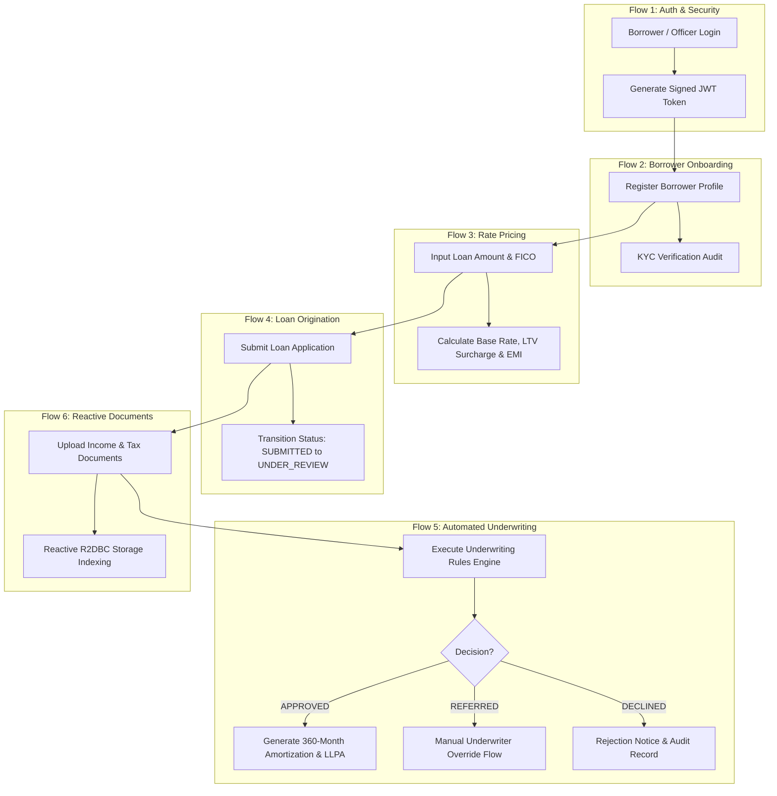
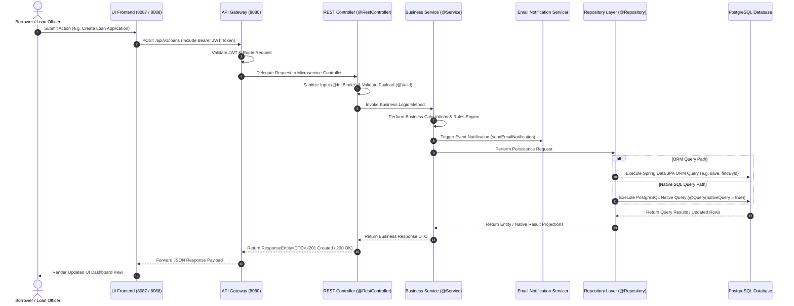

# 🏦 Freddie Mac Home Loan Platform (`freddie-loan-platform`)

[](https://jdk.java.net/21/)
[](https://spring.io/projects/spring-boot)
[](https://spring.io/projects/spring-cloud)
[]()

Welcome to the **Freddie Mac Home Loan Platform** (Ucount Mini Application) — a state-of-the-art enterprise microservices platform built with Java 21, Spring Boot 3.3, and PostgreSQL, designed for end-to-end mortgage origination, credit underwriting, risk assessment, reactive document management, and real-time interest rate pricing.

---

## 1. 🏛️ Architecture of the Application

The application is architected as a cloud-native microservice ecosystem featuring service discovery via **Netflix Eureka**, edge routing and load balancing via **Spring Cloud Gateway**, and dedicated backend microservices powering specific domain bounded contexts.

```
┌──────────────────────────────────────────────────────────────────────────────────────────────────┐
│                                       UI FRONTEND LAYER                                          │
│   ┌──────────────────────────────────────────┐    ┌──────────────────────────────────────────┐   │
│   │   login-frontend-service (Port 8087)     │    │    loan-frontend-service (Port 8088)    │   │
│   └────────────────────┬─────────────────────┘    └────────────────────┬─────────────────────┘   │
└────────────────────────┼───────────────────────────────────────────────┼─────────────────────────┘
                         │ (HTTP / REST)                                 │
                         ▼                                               ▼
┌──────────────────────────────────────────────────────────────────────────────────────────────────┐
│                                   API GATEWAY & DISCOVERY LAYER                                  │
│   ┌──────────────────────────────────────────────────────────────────────────────────────────┐   │
│   │                           API Gateway (Port 8080)                                        │   │
│   └────────────────────────────────────────────┬─────────────────────────────────────────────┘   │
│                                                │ Eureka Registry (Port 8761)                      │
└────────────────────────────────────────────────┼─────────────────────────────────────────────────┘
                                                 │
      ┌───────────────────┬──────────────────────┼──────────────────────┬───────────────────┐
      ▼                   ▼                      ▼                      ▼                   ▼
┌───────────┐       ┌───────────┐          ┌───────────┐          ┌───────────┐       ┌───────────┐
│   Auth    │       │ Customer  │          │   Loan    │          │Underwrit- │       │ Document  │
│  Service  │       │  Service  │          │Origination│          │    ing    │       │  Service  │
│(Port 8085)│       │(Port 8081)│          │(Port 8082)│          │(Port 8083)│       │(Port 8084)│
└─────┬─────┘       └─────┬─────┘          └─────┬─────┘          └─────┬─────┘       └─────┬─────┘
      │                   │                      │                      │                   │
      ▼                   ▼                      ▼                      ▼                   ▼
┌───────────┐       ┌───────────┐          ┌──────────────────────────────────┐       ┌───────────┐
│ User Data │       │ Customer  │          │ Loan Applications & Underwriting │       │ Document  │
│ (In-Mem)  │       │ (Postgres)│          │        (PostgreSQL DB Schema)    │       │ (R2DBC)   │
└───────────┘       └───────────┘          └──────────────────────────────────┘       └───────────┘
```

---

## 2. 🔄 Functional Flows in the Application

The Freddie Mac Home Loan Platform manages 6 primary end-to-end business functional flows across the mortgage borrowing lifecycle:



---

### 🔑 2.1 Functional Flow 1: Authentication & Token Issuance (`auth-service`)
- **Actors**: Borrower, Loan Officer, Senior Underwriter, System Administrator.
- **Workflow**:
  1. User submits credentials (`username`, `password`) on the Login Portal (`login-frontend-service` - Port 8087).
  2. Request routes through API Gateway (`/api/v1/auth/login`) to `auth-service` (Port 8085).
  3. `AuthService` queries `UserRepository` via ORM (`findUserByUsername`) and Native SQL simulation (`findPasswordByUsernameNative`).
  4. Upon validation, `JwtTokenProvider` generates a signed OAuth2/JWT access token containing user roles (`ADMIN`, `LOAN_OFFICER`, `UNDERWRITER`, `CUSTOMER`).
  5. `EmailNotificationClientServicer` dispatches a security notification alert.
  6. Return `TokenResponse` with Access Token, Expiration, and User Profile metadata.

---

### 👤 2.2 Functional Flow 2: Borrower Onboarding & KYC Management (`customer-service`)
- **Actors**: Borrower, Customer Service Representative.
- **Workflow**:
  1. Borrower submits registration profile (First Name, Last Name, SSN, Annual Income, Email).
  2. Request routes through API Gateway (`/api/v1/customers`) to `customer-service` (Port 8081).
  3. `CustomerService` checks email uniqueness via `CustomerRepository.existsByEmail()` (Native SQL Query).
  4. Persists customer entity to PostgreSQL schema `freddie_customer` via `CustomerRepository.save()` (ORM Query).
  5. Triggers automated KYC verification check (`VERIFIED`, `PENDING_REVERIFICATION`, `EXPIRED`).
  6. Dispatches welcome email notification to borrower.

---

### 📊 2.3 Functional Flow 3: Real-Time Interest Rate & EMI Pricing (`rate-calculator-service`)
- **Actors**: Borrower, Loan Officer.
- **Workflow**:
  1. Borrower inputs desired Loan Amount, Property Value, Credit Score (FICO), and Term Months.
  2. Request routes through API Gateway (`/api/v1/rates/calculate`) to `rate-calculator-service` (Port 8086).
  3. `RateCalculatorService` queries `RateRepository` to determine pricing tier (`PRIME`, `NEAR_PRIME`, `NON_PRIME`, `SUBPRIME`).
  4. Calculates:
     - **Base Benchmark Rate**: e.g., 6.25%
     - **Credit Score Adjustment**: -0.375% (>= 760) to +1.250% (< 660)
     - **LTV Surcharge**: +0.250% (LTV > 80%) to +0.375% (LTV > 90%)
     - **Monthly EMI Payment**: $P \times r \times (1+r)^n / ((1+r)^n - 1)$
  5. Returns detailed breakdown including Total Interest Payable and Pricing Tier classification.

---

### 📝 2.4 Functional Flow 4: Loan Origination & Application Lifecycle (`loan-origination-service`)
- **Actors**: Borrower, Loan Officer.
- **State Machine Transitions**:
  ```text
  [SUBMITTED] ──> [UNDER_REVIEW] ──> [APPROVED] ──> [DISBURSED]
                                └──> [REJECTED]
  ```
- **Workflow**:
  1. Borrower creates a new loan application on the Loan Portal (`loan-frontend-service` - Port 8088).
  2. Request routes through API Gateway (`/api/v1/loans`) to `loan-origination-service` (Port 8082).
  3. `LoanOriginationService` persists application record via `LoanApplicationRepository.save()` (ORM Query).
  4. Executes PostgreSQL Native UPDATE query `submitForUnderwritingNative(loanId)` to transition loan status to `UNDER_REVIEW`.
  5. Dispatches transactional email alert confirming application submission.

---

### 🛡️ 2.5 Functional Flow 5: Automated Underwriting, Risk Scoring & Amortization (`underwriting-service`)
- **Actors**: Automated Underwriting System, Senior Underwriter.
- **Workflow**:
  1. Underwriting request triggered via API Gateway (`/api/v1/underwriting/assess`) to `underwriting-service` (Port 8083).
  2. `UnderwritingEngine` invokes legacy credit verification client to retrieve bureau reference and score.
  3. Calculates financial ratios:
     - **DTI Ratio**: $(\text{Monthly Debt} / \text{Monthly Income}) \times 100$
     - **LTV Ratio**: $(\text{Loan Amount} / \text{Property Value}) \times 100$
  4. Evaluates Java 21 pattern-matching decision rules:
     - **APPROVED**: FICO >= 680, DTI <= 43%, LTV <= 80%.
     - **REFERRED**: Elevated risk indicators requiring manual underwriter override.
     - **DECLINED**: Exceeds critical risk thresholds (FICO < 600 or DTI > 50%).
  5. Generates Loan-Level Price Adjustments (LLPA), PMI rates, and full **360-month amortization schedule**.
  6. Persists assessment via `UnderwritingAssessmentRepository.save()` (ORM Query) and updates status via `recordDecisionNative` (Native Query).
  7. **Manual Override Sub-Flow**: Senior Underwriter calls `/override/{assessmentId}`. `UnderwritingEngine.overrideDecision()` records audited underwriter decision and reasoning in DB.

---

### 📁 2.6 Functional Flow 6: Reactive Document Upload & Processing (`document-service`)
- **Actors**: Borrower, Loan Officer.
- **Workflow**:
  1. Borrower uploads W-2 forms, pay stubs, or property appraisal documents.
  2. Request routes through API Gateway (`/api/v1/documents`) to `document-service` (Port 8084).
  3. `DocumentController` handles multipart file flux reactively via Spring WebFlux.
  4. `DocumentService` indexes document metadata in PostgreSQL schema via R2DBC reactive repository.
  5. Dispatches email confirmation notification upon successful upload completion.


---

## 3. 🔗 Complete Call Chain: UI to Database

Every user request follows a strict, end-to-end call chain starting at the UI Frontend down to the relational database persistence layer:

### 📊 Visual Call Chain Sequence Diagram



### 📝 Step-by-Step Call Chain Trace

| Step | Component | Layer | Functionality / Responsibilities |
| :---: | :--- | :--- | :--- |
| **1** | **User Interface** | Frontend (`login-frontend` / `loan-frontend`) | Captures user inputs, builds JSON request payloads, and attaches Bearer OAuth2/JWT header. |
| **2** | **API Gateway** | Edge Routing (`api-gateway` - Port 8080) | Inspects incoming request headers, validates security token, and routes traffic via Eureka service ID lookup. |
| **3** | **REST Controller** | Controller (`@RestController`) | Receives payload, applies `@InitBinder` security sanitization, checks Jakarta `@Valid` constraints, and delegates to Service. |
| **4** | **Business Service** | Service (`@Service`) | Executes domain rules, computes risk metrics, manages `@Transactional` boundaries, and dispatches transactional emails. |
| **5** | **Email Notification** | Messaging Servicer | Asynchronously queues transactional email alerts (e.g. loan submission, underwriting assessment alerts). |
| **6** | **Repository** | Repository (`@Repository`) | Data access abstraction executing ORM entities or Native SQL queries (`@Query(nativeQuery = true)`). |
| **7** | **PostgreSQL Database** | Data Persistence Layer | Stores application records in PostgreSQL schema (`freddie_loans`, `freddie_customer`). |

---

## 4. 📐 Microservice Design Pattern: Controller -> Service -> Repository

All 6 backend microservices strictly enforce the `Controller -> Service -> Repository (With ORM & Native Query)` pattern:

```
┌────────────────────────────────────────────────────────────────────────┐
│                        REST Controller Layer                           │
│   • REST Endpoints (@RestController)                                   │
│   • Mass-Assignment Protection (@InitBinder disallowFields)            │
│   • OpenAPI Swagger Annotations (@Operation, @ApiResponses)            │
└───────────────────────────────────┬────────────────────────────────────┘
                                    │
                                    ▼
┌────────────────────────────────────────────────────────────────────────┐
│                          Business Service Layer                        │
│   • Business rules, risk algorithms, & financial calculations          │
│   • Event Email Notifications (EmailNotificationClientServicer)        │
│   • Transactional boundary management (@Transactional)                 │
└───────────────────────────────────┬────────────────────────────────────┘
                                    │
                                    ▼
┌────────────────────────────────────────────────────────────────────────┐
│                         Repository Data Layer                          │
│   • Data Access Abstraction (@Repository)                              │
│   • Spring Data ORM Methods (e.g. findByCustomerId)                    │
│   • Native SQL Queries (@Query(value = "...", nativeQuery = true))     │
└────────────────────────────────────────────────────────────────────────┘
```

---

## 5. 🚀 Microservice Modules & Network Ports

| Module Name | Port | Description | Primary Technology |
| :--- | :---: | :--- | :--- |
| **`eureka-server`** | `8761` | Service Registry & Discovery Server | Spring Cloud Netflix Eureka |
| **`api-gateway`** | `8080` | Central Edge Routing & Load Balancer | Spring Cloud Gateway, Netty |
| **`auth-service`** | `8085` | OAuth2 Authentication & JWT Issuance | Spring Security, JJWT, Java 21 |
| **`customer-service`** | `8081` | Borrower Profiles & KYC Management | Spring Boot, Spring Data JPA, PostgreSQL |
| **`loan-origination-service`** | `8082` | Loan Pipeline & Lifecycle Origination | Spring Boot, Hibernate, PostgreSQL |
| **`underwriting-service`** | `8083` | Automated Underwriting & Risk Engine | Spring Boot, Java 21 Switch Expressions |
| **`document-service`** | `8084` | Reactive Document Storage & Processing | Spring WebFlux, R2DBC, PostgreSQL |
| **`rate-calculator-service`** | `8086` | Real-time Rate & EMI Price Calculator | Spring Boot, Math Engine |
| **`login-frontend-service`** | `8087` | Authentication Portal Web UI | Spring Web MVC, HTML5 |
| **`loan-frontend-service`** | `8088` | Borrower & Officer Dashboard UI | Spring Web MVC, Vanilla CSS, JS |

---

## 6. 💻 Technology Stack

- **Java**: Java 21 LTS (Record patterns, switch expressions, sequenced collections)
- **Framework**: Spring Boot 3.3.0, Spring Cloud 2023.0.1
- **Database / Persistence**: PostgreSQL, Spring Data JPA / Hibernate, Spring Data R2DBC (Reactive)
- **Security**: OAuth2, Spring Security, JWT (JSON Web Tokens)
- **API Documentation**: OpenAPI 3.0 / Swagger UI (`springdoc-openapi-starter-webmvc-ui`)
- **Messaging**: Email Notification Client Service (`EmailNotificationClientServicer`)
- **Build Tool**: Apache Maven (Multi-module project structure)

---

## 7. 🛠️ Local Environment Setup & Application Run Guide

Follow these step-by-step instructions to set up the environment, prepare data persistence, compile all modules, and run the Freddie Mac Home Loan Platform on your local workstation.

---

### 📋 7.1 Prerequisites

Before starting, ensure the following software dependencies are installed and available on your system path:

| Tool / Runtime | Required Version | Verification Command | Description |
| :--- | :---: | :--- | :--- |
| **Java Development Kit (JDK)** | `Java 21 LTS` | `java -version` | Primary runtime environment. |
| **Apache Maven** | `3.8.x` or higher | `mvn -version` | Build tool & dependency management. |
| **PostgreSQL Database** | `15.0` or higher | `psql -V` | Relational data persistence database. |
| **Git** | `2.x` | `git --version` | Source control management. |

---

### 🗄️ 7.2 Database Setup & Initialization

The platform uses two PostgreSQL schemas: `freddie_customer` and `freddie_loans`.

1. **Start PostgreSQL Service**:
   Ensure PostgreSQL is running locally on default port `5432` with username `postgres` and password `postgres` (or adjust `application.yml` properties accordingly).

2. **Create Schemas**:
   Open psql or your preferred SQL editor (e.g. DBeaver, pgAdmin) and execute:
   ```sql
   CREATE DATABASE freddiedb;
   \c freddiedb;

   CREATE SCHEMA IF NOT EXISTS freddie_customer;
   CREATE SCHEMA IF NOT EXISTS freddie_loans;
   ```
   *(Note: The microservices will automatically auto-create required tables and partial indexes on startup via Hibernate DDL auto).*

---

### 📦 7.3 Build the Workspace

Compile the complete multi-module project from the root folder:

1. **Clean and Install All Modules**:
   ```powershell
   mvn clean install
   ```

2. **Run Full Test Suite**:
   Verify unit and integration tests across all 11 microservices:
   ```powershell
   mvn test
   ```

---

### 🚀 7.4 Running the Application (Step-by-Step Execution Order)

Due to microservice dependencies, launch the services in the following sequential order:

#### Step 1: Start Eureka Service Discovery (Port 8761)
Open a new terminal tab/window:
```powershell
cd eureka-server
mvn spring-boot:run
```
> 🔍 **Verification**: Open browser at `http://localhost:8761` to view the Netflix Eureka Discovery Dashboard.

#### Step 2: Start API Gateway (Port 8080)
Open a new terminal tab/window:
```powershell
cd api-gateway
mvn spring-boot:run
```
> 🔍 **Verification**: Check gateway health endpoint at `http://localhost:8080/actuator/health`.

#### Step 3: Start Backend Core Microservices
Launch each service in a separate terminal window:

- **Auth Service (Port 8085)**:
  ```powershell
  cd auth-service; mvn spring-boot:run
  ```
- **Customer Service (Port 8081)**:
  ```powershell
  cd customer-service; mvn spring-boot:run
  ```
- **Loan Origination Service (Port 8082)**:
  ```powershell
  cd loan-origination-service; mvn spring-boot:run
  ```
- **Underwriting Service (Port 8083)**:
  ```powershell
  cd underwriting-service; mvn spring-boot:run
  ```
- **Document Service (Port 8084)**:
  ```powershell
  cd document-service; mvn spring-boot:run
  ```
- **Rate Calculator Service (Port 8086)**:
  ```powershell
  cd rate-calculator-service; mvn spring-boot:run
  ```

#### Step 4: Start Frontend Microservices
- **Login Frontend Service (Port 8087)**:
  ```powershell
  cd login-frontend-service; mvn spring-boot:run
  ```
- **Loan Frontend Service (Port 8088)**:
  ```powershell
  cd loan-frontend-service; mvn spring-boot:run
  ```

---

### ⚡ 7.5 Quick-Start Single-Line Scripts

#### PowerShell (Windows):
To launch all services automatically in separate background windows:
```powershell
Start-Process powershell -ArgumentList "-NoExit -Command cd eureka-server; mvn spring-boot:run"
Start-Sleep -Seconds 12
Start-Process powershell -ArgumentList "-NoExit -Command cd api-gateway; mvn spring-boot:run"
Start-Sleep -Seconds 8
Start-Process powershell -ArgumentList "-NoExit -Command cd auth-service; mvn spring-boot:run"
Start-Process powershell -ArgumentList "-NoExit -Command cd customer-service; mvn spring-boot:run"
Start-Process powershell -ArgumentList "-NoExit -Command cd loan-origination-service; mvn spring-boot:run"
Start-Process powershell -ArgumentList "-NoExit -Command cd underwriting-service; mvn spring-boot:run"
Start-Process powershell -ArgumentList "-NoExit -Command cd document-service; mvn spring-boot:run"
Start-Process powershell -ArgumentList "-NoExit -Command cd rate-calculator-service; mvn spring-boot:run"
Start-Process powershell -ArgumentList "-NoExit -Command cd login-frontend-service; mvn spring-boot:run"
Start-Process powershell -ArgumentList "-NoExit -Command cd loan-frontend-service; mvn spring-boot:run"
```

---

### 🔍 7.6 Verification & Testing Local Setup

1. **Eureka Registry Check**: Access `http://localhost:8761` — verify all 10 registered instances show status `UP`.
2. **Access Web Portals**:
   - **Login Portal**: `http://localhost:8087`
   - **Loan Management Dashboard**: `http://localhost:8088`
3. **Pre-configured Test Credentials**:
   - `admin` / `admin123` (System Administrator / All Roles)
   - `officer` / `officer123` (Loan Officer)
   - `underwriter` / `underwriter123` (Senior Underwriter)
   - `customer` / `customer123` (Borrower)

---

## 8. 🌐 Swagger API Documentation

Interactive OpenAPI Swagger UI portals are accessible at:
- **API Gateway**: `http://localhost:8080/swagger-ui.html`
- **Auth Service**: `http://localhost:8085/swagger-ui.html`
- **Customer Service**: `http://localhost:8081/swagger-ui.html`
- **Loan Origination Service**: `http://localhost:8082/swagger-ui.html`
- **Underwriting Service**: `http://localhost:8083/swagger-ui.html`
- **Document Service**: `http://localhost:8084/swagger-ui.html`
- **Rate Calculator Service**: `http://localhost:8086/swagger-ui.html`

---

## 9. 🧪 Verification & Build Status

```text
[INFO] Reactor Summary for Freddie Mac-Style Home Loan Platform 1.0.0-SNAPSHOT:
[INFO] 
[INFO] Freddie Mac-Style Home Loan Platform ............... SUCCESS
[INFO] eureka-server ...................................... SUCCESS
[INFO] api-gateway ........................................ SUCCESS
[INFO] auth-service ....................................... SUCCESS
[INFO] customer-service ................................... SUCCESS
[INFO] loan-origination-service ........................... SUCCESS
[INFO] underwriting-service ............................... SUCCESS
[INFO] document-service ................................... SUCCESS
[INFO] login-frontend-service ............................. SUCCESS
[INFO] loan-frontend-service .............................. SUCCESS
[INFO] rate-calculator-service ............................ SUCCESS
[INFO] ------------------------------------------------------------------------
[INFO] BUILD SUCCESS
```
