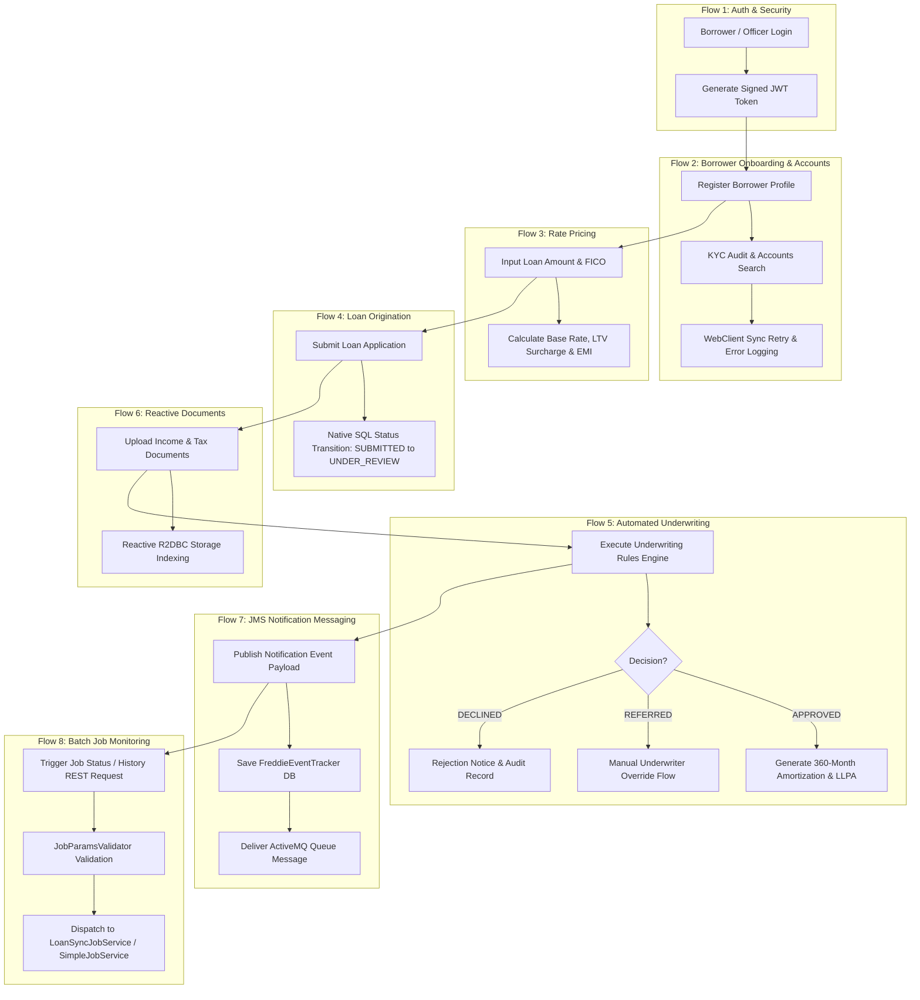
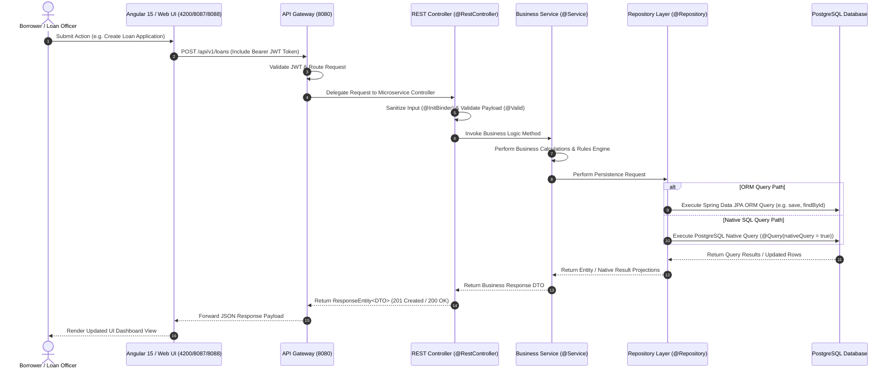
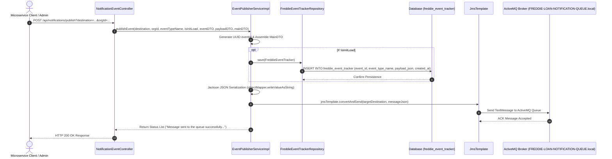

# 🏦 Freddie Mac Home Loan Platform (`freddie-loan-platform`)

[](https://jdk.java.net/17/)
[](https://spring.io/projects/spring-boot)
[](https://spring.io/projects/spring-cloud)
[](https://activemq.apache.org/)
[](https://angular.io/)
[]()

Welcome to the **Freddie Mac Home Loan Platform** (Ucount Mini Application) — a single, unified enterprise microservices workspace built with **Angular 15**, **Java 17**, **Spring Boot 3.1.3**, **ActiveMQ JMS Messaging**, and **PostgreSQL**, designed for end-to-end mortgage origination, credit underwriting, risk assessment, reactive document management, real-time interest rate pricing, and event-driven notifications.

---

## 1. 🏛️ Architecture of the Application

The application is architected as a cloud-native microservice ecosystem featuring service discovery via **Netflix Eureka**, edge routing and load balancing via **Spring Cloud Gateway**, Angular 15 web interface, ActiveMQ event-driven message queuing, and dedicated backend microservices.

```
┌───────────────────────────────────────────────────────────────────────────────────────────────────────────────────┐
│                                               UI FRONTEND LAYER                                                   │
│   ┌──────────────────────────────────────────┐    ┌──────────────────────────────────────────┐                    │
│   │   Angular 15 Frontend (`/frontend`)      │    │    loan-frontend-service (Port 8088)    │                    │
│   └────────────────────┬─────────────────────┘    └────────────────────┬─────────────────────┘                    │
└────────────────────────┼───────────────────────────────────────────────┼──────────────────────────────────────────┘
                         │ (HTTP / REST)                                 │
                         ▼                                               ▼
┌───────────────────────────────────────────────────────────────────────────────────────────────────────────────────┐
│                                           API GATEWAY & DISCOVERY LAYER                                           │
│   ┌───────────────────────────────────────────────────────────────────────────────────────────────────────────┐   │
│   │                                   API Gateway (Port 8080)                                                 │   │
│   └────────────────────────────────────────────┬──────────────────────────────────────────────────────────────┘   │
│                                                │ Eureka Registry (Port 8761)                                      │
└────────────────────────────────────────────────┼──────────────────────────────────────────────────────────────────┘
                                                 │
      ┌───────────────────┬──────────────────────┼──────────────────────┬───────────────────┬──────────────────┐
      ▼                   ▼                      ▼                      ▼                   ▼                  ▼
┌───────────┐       ┌───────────┐          ┌───────────┐          ┌───────────┐       ┌───────────┐      ┌───────────┐
│   Auth    │       │ Customer  │          │   Loan    │          │Underwrit- │       │ Document  │      │Notification│
│  Service  │       │  Service  │          │Origination│          │    ing    │       │  Service  │      │  Service  │
│(Port 8085)│       │(Port 8081)│          │(Port 8082)│          │(Port 8083)│       │(Port 8084)│      │(Port 8086)│
└─────┬─────┘       └─────┬─────┘          └─────┬─────┘          └─────┬─────┘       └─────┬─────┘      └─────┬─────┘
      │                   │                      │                      │                   │                  │
      ▼                   ▼                      ▼                      ▼                   ▼                  ▼
┌───────────┐       ┌───────────┐          ┌──────────────────────────────────┐       ┌───────────┐      ┌───────────┐
│ User Data │       │ Customer  │          │ Loan Applications & Underwriting │       │ Document  │      │ ActiveMQ  │
│ (In-Mem)  │       │ (Postgres)│          │        (PostgreSQL DB Schema)    │       │ (R2DBC)   │      │ & DB Event│
└───────────┘       └───────────┘          └──────────────────────────────────┘       └───────────┘      └───────────┘
```

---

## 2. 🔄 Functional Flows in the Application

The Freddie Mac Home Loan Platform manages 8 primary end-to-end business functional flows across the mortgage borrowing lifecycle:



---

### 🔑 2.1 Functional Flow 1: Authentication & Token Issuance (`auth-service`)
- **Actors**: Borrower, Loan Officer, Senior Underwriter, System Administrator.
- **Workflow**:
  1. User submits credentials (`username`, `password`) on the Login Portal (`login-frontend-service` - Port 8087).
  2. Request routes through API Gateway (`/api/v1/auth/login`) to `auth-service` (Port 8085).
  3. `AuthService` queries `UserRepository` via ORM (`findUserByUsername`) and Native SQL simulation (`findPasswordByUsernameNative`).
  4. Upon validation, `JwtTokenProvider` generates a signed OAuth2/JWT access token containing user roles (`ADMIN`, `LOAN_OFFICER`, `UNDERWRITER`, `CUSTOMER`).
  5. Validates tokens via `GET /api/v1/auth/validate` and fetches profile metadata via `GET /api/v1/auth/user`.
  6. Returns `TokenResponse` with Access Token, Expiration, and User Profile metadata.

---

### 👤 2.2 Functional Flow 2: Borrower Onboarding, Accounts & Sync Management (`customer-service`)
- **Actors**: Borrower, Customer Service Representative, External OIM System.
- **Workflow**:
  1. Borrower submits registration profile (`POST /api/v1/customers` - First Name, Last Name, SSN, Income, Email).
  2. `CustomerService` validates email uniqueness via `CustomerRepository.existsByEmail()` (Native SQL Query).
  3. Persists customer entity to PostgreSQL schema `freddie_customer` via `CustomerRepository.save()` (ORM Query).
  4. Manages counterparty accounts (`UcsCntprtyAcct`) via `AccountsProfileController` (`GET /api/v1/customers/accounts/{accountId}`).
  5. Supports user sync bypass via `byPassUserSync(userId, reason)` when `api.byPassUser` or system user list match.
  6. Executes background sync via `APIServiceImpl` (`oimDataSyncThreadpool`) with WebClient exponential backoff retry (`Retry.backoff`).
  7. On retry exhaustion, saves failure details to database via `CustomerSyncErrLogRepository` (`customer_sync_err_log` table).

---

### 📊 2.3 Functional Flow 3: Real-Time Interest Rate & EMI Pricing (`rate-calculator-service`)
- **Actors**: Borrower, Loan Officer.
- **Workflow**:
  1. Borrower inputs Loan Amount, Property Value, Credit Score (FICO), and Term Months (`POST /api/v1/rates/calculate`).
  2. Request routes through API Gateway to `rate-calculator-service` (Port 8089).
  3. `RateCalculatorService` queries `RateRepository` to determine pricing tier (`PRIME`, `NEAR_PRIME`, `NON_PRIME`, `SUBPRIME`).
  4. Calculates Base Benchmark Rate, Credit Score Adjustment, LTV Surcharge, and 30-year monthly EMI.
  5. Exposes health monitoring via `GET /api/v1/rates/health`.

---

### 📝 2.4 Functional Flow 4: Loan Origination & Application Lifecycle (`loan-origination-service`)
- **Actors**: Borrower, Loan Officer.
- **Workflow**:
  1. Borrower creates a mortgage application on the Loan Portal (`loan-frontend-service` - Port 8088).
  2. Request routes through API Gateway (`/api/v1/loans/submit`) to `loan-origination-service` (Port 8082).
  3. `LoanOriginationService` persists application record via `LoanApplicationRepository.save()` (ORM Query).
  4. Executes PostgreSQL Native UPDATE query `submitForUnderwritingNative(loanId)` (`POST /api/v1/loans/{loanId}/submit-underwriting`) to transition loan status from `SUBMITTED` to `UNDER_REVIEW`.
  5. Triggers underwriting assessment pipeline.

---

### 🛡️ 2.5 Functional Flow 5: Automated Underwriting, Risk Scoring & Amortization (`underwriting-service`)
- **Actors**: Automated Underwriting System (AUS), Senior Underwriter.
- **Workflow**:
  1. Underwriting request triggered via API Gateway (`POST /api/v1/underwriting/assess`) to `underwriting-service` (Port 8083).
  2. `UnderwritingEngine` calculates DTI and LTV ratios, evaluating Java 17 pattern-matching decision rules (`APPROVED`, `REFERRED`, `DECLINED`).
  3. Generates Loan-Level Price Adjustments (LLPA), PMI rates, and full 360-month amortization schedule.
  4. Persists assessment via `UnderwritingAssessmentRepository.save()` (ORM Query) and updates status via `recordDecisionNative` (Native Query).
  5. Supports Senior Underwriter manual override via `UnderwritingEngine.overrideDecision()` (`POST /api/v1/underwriting/override`).

---

### 📁 2.6 Functional Flow 6: Reactive Document Upload & Processing (`document-service`)
- **Actors**: Borrower, Loan Officer.
- **Workflow**:
  1. Borrower uploads income or tax documents (`POST /api/v1/documents/upload`).
  2. Request routes through API Gateway (`/api/v1/documents`) to `document-service` (Port 8084).
  3. `DocumentController` handles multipart file flux reactively via Spring WebFlux.
  4. `DocumentService` indexes document metadata in PostgreSQL schema via R2DBC reactive repository (`GET /api/v1/documents/{documentId}` & `DELETE /api/v1/documents/{documentId}`).

---

### 📨 2.7 Functional Flow 7: Asynchronous Notification & ActiveMQ JMS Messaging (`notification-service`)
- **Actors**: External Microservices, Notification Producer, Messaging Consumer.
- **Workflow**:
  1. Notification event request submitted to REST endpoint `POST /api/notifications/publish` on `notification-service` (Port 8086).
  2. `EventPublisherServiceImpl` generates a unique UUID `eventId` and composes `EventDTO`, `PayloadDTO`, and `MainDTO`.
  3. If not an initial load (`!isInitLoad`), persists initial event record to `FreddieEventTrackerRepository` (`freddie_event_tracker` database table).
  4. Serializes `MainDTO` to JSON payload via `ObjectMapper.writeValueAsString()`.
  5. Resolves target queue destination (defaulting to `FREDDIE-LOAN-NOTIFICATION-QUEUE.local` configured via `@Value("${spring.activemq.queue-name}")`).
  6. Sends message payload to ActiveMQ destination queue via Spring `JmsTemplate.convertAndSend()`.
  7. Returns message delivery confirmation status.

---

### ⏱️ 2.8 Functional Flow 8: Batch Job Status & History Execution (`notification-service`)
- **Actors**: Operations Administrator, Batch System Scheduler.
- **Workflow**:
  1. Batch monitoring request submitted to `POST /jobs/{jobName}/status` or `POST /jobs/{jobName}/history`.
  2. `BatchJobController` wraps parameter payload in `MapBindingResult`.
  3. `JobParamsValidator.validate()` validates input map parameters.
  4. If validation errors occur, `ProcessValidationUtil.parseErrors()` formats and returns error response.
  5. Dynamically routes to `@Service("loanSyncJobService")` for `"freddie-loan-sync-job"` or `@Service("simpleJobService")` for default batch jobs.
  6. Returns execution status, processed record count, or historic execution logs.

---

## 3. 🔗 Complete Call Chains: UI / Client to Database

### 3.1 Standard CRUD & Business Call Chain


### 3.2 JMS Message Publishing & Event Tracking Call Chain


---

## 4. 📐 Microservice Design Pattern: Controller -> Service -> Repository

All backend microservices strictly enforce the `Controller -> Service -> Repository (With ORM & Native Query)` pattern:

```
┌────────────────────────────────────────────────────────────────────────┐
│                        REST Controller Layer                           │
│   • REST Endpoints (@RestController)                                   │
│   • Mass-Assignment Protection (@InitBinder disallowFields)            │
│   • OpenAPI Swagger Annotations (@Operation, @ApiResponses)            │
└───────────────────────────────────┬────────────────────────────────────┘
                                    │
                                    ▼
┌────────────────────────────────────────────────────────────────────────┐
│                          Business Service Layer                        │
│   • Business rules, risk algorithms, & financial calculations          │
│   • JMS Event Publishing & Notification Tracking                       │
│   • Transactional boundary management (@Transactional)                 │
└───────────────────────────────────┬────────────────────────────────────┘
                                    │
                                    ▼
┌────────────────────────────────────────────────────────────────────────┐
│                         Repository Data Layer                          │
│   • Data Access Abstraction (@Repository)                              │
│   • Spring Data ORM Methods (e.g. findByCustomerId)                    │
│   • Native SQL Queries (@Query(value = "...", nativeQuery = true))     │
└────────────────────────────────────────────────────────────────────────┘
```

---

## 5. 🚀 Microservice Modules & Network Ports

| Module Name | Port | Description | Primary Technology |
| :--- | :---: | :--- | :--- |
| **`eureka-server`** | `8761` | Service Registry & Discovery Server | Spring Cloud Netflix Eureka |
| **`api-gateway`** | `8080` | Central Edge Routing & Load Balancer | Spring Cloud Gateway, Netty |
| **`auth-service`** | `8085` | OAuth2 Authentication & JWT Issuance | Spring Security, JJWT, Java 17 |
| **`customer-service`** | `8081` | Borrower Profiles & KYC Management | Spring Boot, Spring Data JPA, PostgreSQL |
| **`loan-origination-service`** | `8082` | Loan Pipeline & Lifecycle Origination | Spring Boot, Hibernate, PostgreSQL |
| **`underwriting-service`** | `8083` | Automated Underwriting & Risk Engine | Spring Boot, Java 17 Switch Expressions |
| **`document-service`** | `8084` | Reactive Document Storage & Processing | Spring WebFlux, R2DBC, PostgreSQL |
| **`notification-service`** | `8086` | ActiveMQ JMS Messaging & Batch Job Execution | Spring Boot, ActiveMQ JmsTemplate, JPA |
| **`rate-calculator-service`** | `8089` | Real-time Rate & EMI Price Calculator | Spring Boot, Math Engine |
| **`login-frontend-service`** | `8087` | Authentication Portal Web UI | Spring Web MVC, HTML5 |
| **`loan-frontend-service`** | `8088` | Borrower & Officer Dashboard UI | Spring Web MVC, Vanilla CSS, JS |
| **`frontend`** | `4200` | Angular 15 Enterprise Portal | Angular 15.2.0, TypeScript 4.9 |

---

## 6. 💻 Technology Stack & UCount Project Alignment

All microservices adhere strictly to the enterprise **UCount Project** technology specifications:

| Requirement Dimension | Specification | Project Implementation & Compliance Status |
| :--- | :--- | :--- |
| **Frontend Framework** | **Angular 15** | ✅ Angular 15.2.0 (`@angular/core`: `^15.2.0`, `@angular/cli`: `^15.2.0`) in `frontend/package.json`. |
| **Backend Language & Stack** | **Java 17, Spring, Spring Boot 3.x** | ✅ Java 17 LTS (`<java.version>17</java.version>`) & Spring Boot `3.1.3` across all modules. |
| **Data Access & Queries** | **Spring JPA ORM & Native Query** | ✅ Dual data access layer: Spring Data JPA ORM & High-performance PostgreSQL Native Queries (`@Query(nativeQuery = true)`). |
| **Message Queue & JMS** | **Spring ActiveMQ & JmsTemplate** | ✅ ActiveMQ messaging integration with `JmsTemplate.convertAndSend()`, event tracking DB persistence, and redelivery policies. |
| **Batch Job Execution** | **Spring MapBindingResult & Validator** | ✅ `BatchJobController` with `JobParamsValidator`, `ProcessValidationUtil`, and dynamic job service qualifiers (`loanSyncJobService`, `simpleJobService`). |
| **Database Engine & Objects** | **Postgres DB (2 DBs) - Tables & Views only** | ✅ PostgreSQL databases/schemas (`freddie_customer` & `freddie_loans`). **No Stored Procedures** — clean relational schema using Tables and Views exclusively. |
| **Unit Testing Framework** | **JUnit 4.x / JUnit 5** | ✅ JUnit 4.13.2 / JUnit Jupiter with `junit-vintage-engine` & `spring-boot-starter-test` across all service test suites. |
| **Backend Design Pattern** | **`Controller -> Service -> Repository`** | ✅ Architectural pattern: Controllers call Services, Services delegate data access to Repositories (ORM & Native SQL queries). |

---

## 7. 🛠️ Local Environment Setup & Application Run Guide

### 📋 7.1 Prerequisites
- **Java 17 LTS**: `java -version`
- **Apache Maven 3.8+**: `mvn -version`
- **Node.js (18.x) & Angular CLI**: `node -v`, `ng version`
- **PostgreSQL 15+**: `psql -V`

### 🗄️ 7.2 Database Setup & Initialization
The platform uses **2 PostgreSQL databases**: `freddie_customer` and `freddie_loans`.

```sql
CREATE DATABASE freddie_customer;
CREATE DATABASE freddie_loans;

\c freddie_customer;
CREATE SCHEMA IF NOT EXISTS freddie_customer;
CREATE SCHEMA IF NOT EXISTS freddie_cards;

\c freddie_loans;
CREATE SCHEMA IF NOT EXISTS freddie_loans;
CREATE SCHEMA IF NOT EXISTS freddie_uw;
```
*(No Stored Procedures — schema strictly consists of Tables and Views).*

---

### 📦 7.3 Build the Workspace

1. **Build All Java Microservices**:
   ```powershell
   mvn clean install
   ```

2. **Run All Backend Tests**:
   ```powershell
   mvn test
   ```

3. **Install Angular 15 Dependencies**:
   ```powershell
   cd frontend
   npm install
   ```

---

### 🚀 7.4 Running the Application

Launch microservices in sequential order:
1. **Eureka Server**: `cd eureka-server; mvn spring-boot:run` (Port 8761)
2. **API Gateway**: `cd api-gateway; mvn spring-boot:run` (Port 8080)
3. **Core Microservices**: `auth-service` (8085), `customer-service` (8081), `loan-origination-service` (8082), `underwriting-service` (8083), `document-service` (8084), `notification-service` (8086), `rate-calculator-service` (8089).
4. **Angular 15 Frontend**:
   ```powershell
   cd frontend
   ng serve --port 4200
   ```

---

## 8. 🌐 Swagger API Documentation

OpenAPI Swagger UI portals:
- **API Gateway**: `http://localhost:8080/swagger-ui.html`
- **Auth Service**: `http://localhost:8085/swagger-ui.html`
- **Customer Service**: `http://localhost:8081/swagger-ui.html`
- **Loan Origination Service**: `http://localhost:8082/swagger-ui.html`
- **Underwriting Service**: `http://localhost:8083/swagger-ui.html`
- **Document Service**: `http://localhost:8084/swagger-ui.html`
- **Notification Service**: `http://localhost:8086/swagger-ui.html`
- **Rate Calculator Service**: `http://localhost:8089/swagger-ui.html`

---

## 9. 🗄️ Database Architecture & Schemas (2 PostgreSQL Databases)

All backend microservices connect to **exactly 2 PostgreSQL databases**:

| Database | Purpose | Associated Schemas | Services |
| :--- | :--- | :--- | :--- |
| `freddie_customer` | Customer-facing, Notification Tracking & Binary Data | `freddie_customer`, `freddie_cards` | `customer-service`, `document-service`, `notification-service` |
| `freddie_loans` | Loan Lifecycle & Risk Decisioning | `freddie_loans`, `freddie_uw` | `loan-origination-service`, `underwriting-service` |

*(Note: Strictly Tables and Views are used. Stored Procedures are intentionally omitted to maintain clean ORM & Native Query abstraction).*

---

## 10. 🅰️ Angular 15 Frontend Commands

The Angular frontend is built with **Angular 15.2.0** (`@angular/core`: `^15.2.0`):

- **Start Dev Server**: `ng serve` (Available at `http://localhost:4200/`)
- **Build Production**: `ng build` (Output in `dist/` folder)
- **Run Unit Tests**: `ng test` (Karma/Jasmine test runner)

---

## 11. 🧪 Verification & Build Status

```text
[INFO] Reactor Summary for Freddie Mac-Style Home Loan Platform 1.0.0-SNAPSHOT:
[INFO] 
[INFO] Freddie Mac-Style Home Loan Platform ............... SUCCESS
[INFO] eureka-server ...................................... SUCCESS
[INFO] api-gateway ........................................ SUCCESS
[INFO] auth-service ....................................... SUCCESS
[INFO] customer-service ................................... SUCCESS
[INFO] loan-origination-service ........................... SUCCESS
[INFO] underwriting-service ............................... SUCCESS
[INFO] document-service ................................... SUCCESS
[INFO] login-frontend-service ............................. SUCCESS
[INFO] loan-frontend-service .............................. SUCCESS
[INFO] rate-calculator-service ............................ SUCCESS
[INFO] notification-service ............................... SUCCESS
[INFO] ------------------------------------------------------------------------
[INFO] BUILD SUCCESS
```
