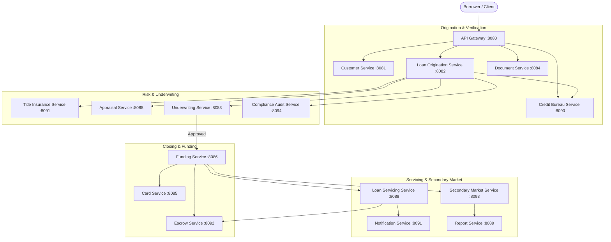

# Implementation Plan: Expand Architecture to 18 Microservices

Expand the platform architecture to **18 distinct microservices** by adding 4 new domain services that complete the end-to-end mortgage lifecycle (Title Insurance, Escrow Management, Secondary Market / MBS Pooling, and Regulatory Compliance Audit).

## User Review Required

> [!IMPORTANT]
> To reach exactly 18 microservices, we will implement 4 new Spring Boot microservices that align with existing mortgage platform functionality and inter-service workflows.

> [!NOTE]
> All new microservices will strictly adhere to the project standards:
> - Layered Pattern: **`Controller` → `Service` → `Repository`**
> - Repositories: Both **Spring Data ORM methods** and **PostgreSQL Native Queries (`@Query(..., nativeQuery = true)`)**
> - Dual PostgreSQL Database Integration (`freddie_loans`)
> - API Gateway Routing & Eureka Registration
> - JUnit 4 & Mockito Unit Tests

---

## Current vs Target Microservice Portfolio (18 Total)

| # | Microservice Name | Domain / Purpose | Port | Database |
|---|---|---|---|---|
| 1 | `eureka-server` | Service Registry & Discovery | 8761 | - |
| 2 | `api-gateway` | API Gateway & Routing | 8080 | Redis (Rate Limiting) |
| 3 | `customer-service` | Borrower Registration & KYC | 8081 | `freddie_customer` |
| 4 | `loan-origination-service` | Mortgage Application & Workflow | 8082 | `freddie_loans` |
| 5 | `underwriting-service` | Automated Credit & Risk Engine | 8083 | `freddie_loans` |
| 6 | `document-service` | Document Storage & Verification (R2DBC) | 8084 | `freddie_customer` |
| 7 | `messaging-service` | JMS ActiveMQ Broker & Queuing | 8087 | - |
| 8 | `card-service` | Borrower Disbursement Card | 8085 | `freddie_cards` |
| 9 | `appraisal-service` | Property Valuation & Appraisal | 8088 | `freddie_loans` |
| 10 | `funding-service` | Loan Closing & Disbursement | 8086 | `freddie_loans` |
| 11 | `report-service` | Portfolio Analytics & Reporting | 8089 | `freddie_loans` |
| 12 | `notification-service` | Email & SMS Dispatch | 8091 | `freddie_customer` |
| 13 | `loan-servicing-service` | Amortization & Repayment Servicing | 8089 | `freddie_loans` |
| 14 | `credit-bureau-service` | Credit Scoring & Bureau History | 8090 | `freddie_loans` |
| **15** | **`title-insurance-service` [NEW]** | Title Search, Lien Clearance & Policy | 8091 | `freddie_loans` |
| **16** | **`escrow-service` [NEW]** | Property Tax & Insurance Escrow | 8092 | `freddie_loans` |
| **17** | **`secondary-market-service` [NEW]** | MBS Pooling & Freddie Mac Sales | 8093 | `freddie_loans` |
| **18** | **`compliance-audit-service` [NEW]** | HMDA, TRID & AML Audit Logging | 8094 | `freddie_loans` |

---

## End-to-End Functional Flow



---

## Proposed Changes

### Database Layer

#### [NEW] [09_title_insurance_schema.sql](file:///c:/ramu/Project_Assignment/RapidX/FreddeMac_Project_RapidX/Work/UCount_App/Ucount_Application/freddie-loan-platform/database/postgresql/ddl/09_title_insurance_schema.sql)
- Table `freddie_loans.title_policies` (Title search, lien clearance, policy status).

#### [NEW] [10_escrow_schema.sql](file:///c:/ramu/Project_Assignment/RapidX/FreddeMac_Project_RapidX/Work/UCount_App/Ucount_Application/freddie-loan-platform/database/postgresql/ddl/10_escrow_schema.sql)
- Table `freddie_loans.escrow_accounts` (Escrow balances, property tax, hazard insurance).

#### [NEW] [11_secondary_market_schema.sql](file:///c:/ramu/Project_Assignment/RapidX/FreddeMac_Project_RapidX/Work/UCount_App/Ucount_Application/freddie-loan-platform/database/postgresql/ddl/11_secondary_market_schema.sql)
- Table `freddie_loans.mbs_pools` (MBS pool details, loan allocations, investor sale price).

#### [NEW] [12_compliance_audit_schema.sql](file:///c:/ramu/Project_Assignment/RapidX/FreddeMac_Project_RapidX/Work/UCount_App/Ucount_Application/freddie-loan-platform/database/postgresql/ddl/12_compliance_audit_schema.sql)
- Table `freddie_loans.compliance_audits` (TRID/HMDA compliance checks, AML audit trails).

---

### New Microservices Implementation

#### 1. `title-insurance-service`
- **Path**: `title-insurance-service/`
- **Files**: `pom.xml`, `TitleInsuranceApplication.java`, `TitlePolicy.java`, `TitlePolicyRepository.java` (ORM + Native Queries), `TitleInsuranceService.java`, `TitleInsuranceController.java` (`/api/v1/title/**`), `TitleInsuranceServiceTest.java`.

#### 2. `escrow-service`
- **Path**: `escrow-service/`
- **Files**: `pom.xml`, `EscrowApplication.java`, `EscrowAccount.java`, `EscrowAccountRepository.java` (ORM + Native Queries), `EscrowService.java`, `EscrowController.java` (`/api/v1/escrow/**`), `EscrowServiceTest.java`.

#### 3. `secondary-market-service`
- **Path**: `secondary-market-service/`
- **Files**: `pom.xml`, `SecondaryMarketApplication.java`, `MbsPool.java`, `MbsPoolRepository.java` (ORM + Native Queries), `SecondaryMarketService.java`, `SecondaryMarketController.java` (`/api/v1/secondary-market/**`), `SecondaryMarketServiceTest.java`.

#### 4. `compliance-audit-service`
- **Path**: `compliance-audit-service/`
- **Files**: `pom.xml`, `ComplianceAuditApplication.java`, `ComplianceAudit.java`, `ComplianceAuditRepository.java` (ORM + Native Queries), `ComplianceAuditService.java`, `ComplianceAuditController.java` (`/api/v1/compliance/**`), `ComplianceAuditServiceTest.java`.

---

### Platform Configuration & Infrastructure

#### [MODIFY] [pom.xml](file:///c:/ramu/Project_Assignment/RapidX/FreddeMac_Project_RapidX/Work/UCount_App/Ucount_Application/freddie-loan-platform/pom.xml)
- Add 4 new child `<module>` elements to root `pom.xml`.

#### [MODIFY] [application.properties](file:///c:/ramu/Project_Assignment/RapidX/FreddeMac_Project_RapidX/Work/UCount_App/Ucount_Application/freddie-loan-platform/api-gateway/src/main/resources/application.properties)
- Add API Gateway routing for `/api/v1/title/**`, `/api/v1/escrow/**`, `/api/v1/secondary-market/**`, `/api/v1/compliance/**`.

#### [MODIFY] [docker-compose.yml](file:///c:/ramu/Project_Assignment/RapidX/FreddeMac_Project_RapidX/Work/UCount_App/Ucount_Application/freddie-loan-platform/deployment/docker-compose.yml) & [k8s-deployment.yaml](file:///c:/ramu/Project_Assignment/RapidX/FreddeMac_Project_RapidX/Work/UCount_App/Ucount_Application/freddie-loan-platform/deployment/k8s-deployment.yaml)
- Add container services & deployments for all 4 new microservices.

---

## Verification Plan

### Automated Tests
- Run unit tests for each new microservice:
  ```bash
  mvn test -pl title-insurance-service,escrow-service,secondary-market-service,compliance-audit-service
  ```

### Functional Flow & Module Count Verification
- Confirm total microservice module count = 18 (`dir /b` in root folder).
- Verify Eureka registration and Gateway routes for all 18 microservices.
